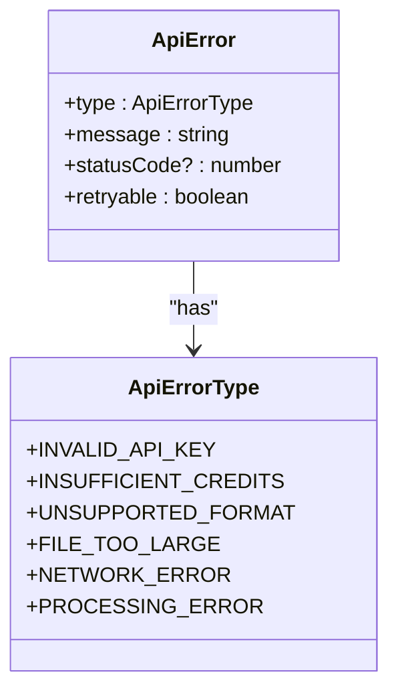
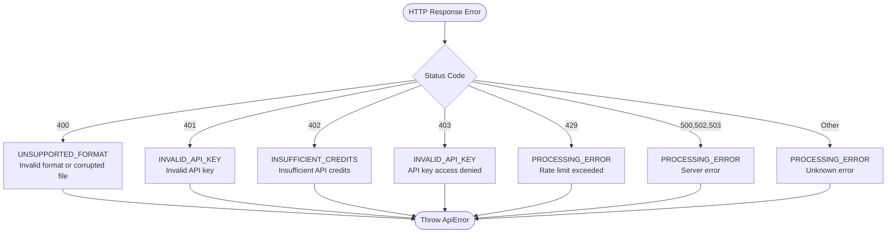
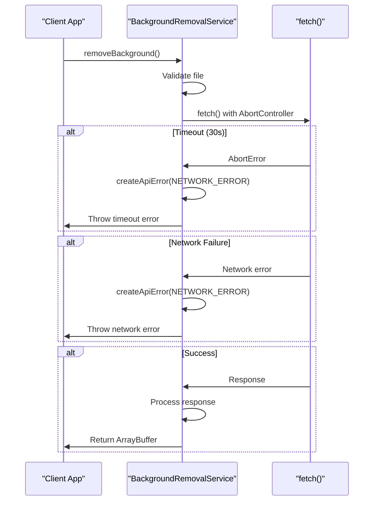
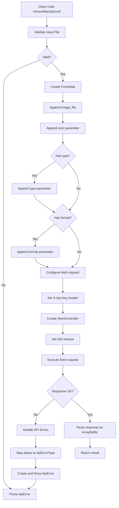
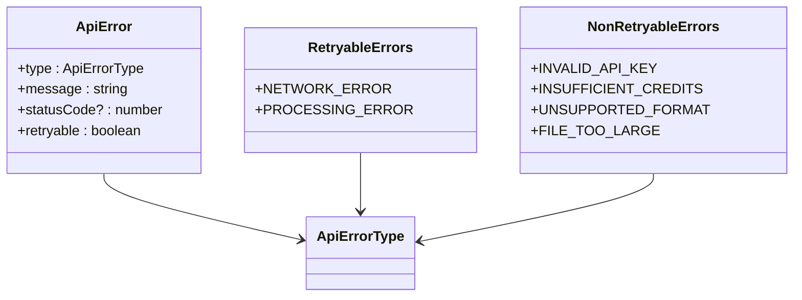
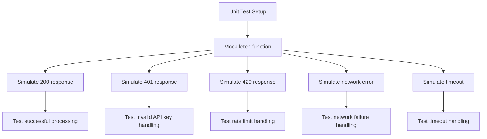
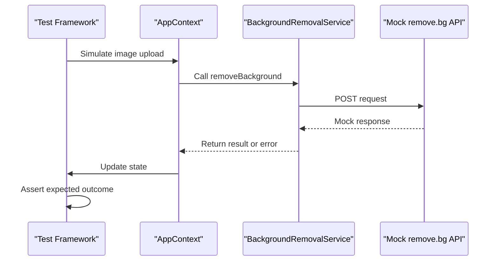

# API Integration Layer

## Table of Contents
1. [Introduction](#introduction)
2. [Core Functionality](#core-functionality)
3. [API Key Management](#api-key-management)
4. [Error Handling](#error-handling)
5. [Request Flow](#request-flow)
6. [Rate Limiting and Retry Strategies](#rate-limiting-and-retry-strategies)
7. [Testing Guidance](#testing-guidance)
8. [Security Considerations](#security-considerations)
9. [Troubleshooting](#troubleshooting)
10. [Performance Optimization](#performance-optimization)

## Introduction
The BackgroundRemovalService module provides a robust interface for integrating with the remove.bg REST API to remove image backgrounds using AI processing. This service handles all aspects of the API interaction including request construction, authentication, error handling, and response processing. The implementation follows modern web standards with TypeScript typing, proper error categorization, and secure API key management through environment variables.

## Core Functionality

The `removeBackground` function is the primary interface for background removal operations. It accepts an image file and processing options, returning a Promise that resolves to an ArrayBuffer containing the processed image data.

**Function Signature**
- [removeBackground](../../src/services/backgroundRemovalService.ts#L15-L41): (imageFile: File, options: RemovalOptions) => Promise<ArrayBuffer>

**Parameters**
- [imageFile](../../src/services/backgroundRemovalService.ts#L15): The input image file to process (File object)
- [options](../../src/services/backgroundRemovalService.ts#L15): Configuration object specifying processing parameters

**RemovalOptions Interface**
- [size](../../src/types/index.ts#L14): 'auto' | 'preview' | 'full' - Output resolution
- [type](../../src/types/index.ts#L15): 'auto' | 'person' | 'product' - Subject type for optimized processing
- [format](../../src/types/index.ts#L16): 'png' | 'jpg' - Output format

**Request Construction**
The service constructs requests using FormData to properly format multipart form data required by the remove.bg API. The request includes:
- Image file as 'image_file' field
- Size parameter
- Optional type and format parameters
- X-Api-Key header with authentication

**Section sources**
- [backgroundRemovalService.ts](../../src/services/backgroundRemovalService.ts#L15-L41)
- [index.ts](../../src/types/index.ts#L13-L22)

## API Key Management

The service implements secure API key management using Vite's environment variable system, ensuring keys are not exposed in client-side code.

**Environment Variable Configuration**
The API key is accessed through Vite's import.meta.env system, which processes environment variables at build time:

```typescript
private readonly apiKey = import.meta.env.VITE_REMOVE_BG_API_KEY;
```

**Environment File Setup**
Create a .env file in the project root (not committed to version control) with your API key:

```
VITE_REMOVE_BG_API_KEY=your_actual_api_key_here
```

**Security Implementation**
- Environment variables prefixed with VITE_ are exposed to the client-side code
- The key is only available during the build process and not stored in source control
- No hardcoded API keys in the source code
- Keys are not exposed in network requests beyond the necessary X-Api-Key header

**Section sources**
- [backgroundRemovalService.ts](../../src/services/backgroundRemovalService.ts#L14)
- [.env.example](../../.env.example#L0)
- [vite.config.ts](../../vite.config.ts#L0-L6)

## Error Handling

The service implements comprehensive error handling for various failure scenarios, categorizing errors for appropriate user feedback and recovery strategies.

**Error Types**
The ApiErrorType enum defines all possible error categories:



**Diagram sources**
- [index.ts](../../src/types/index.ts#L3-L11)

**HTTP Response Error Mapping**
The service maps HTTP status codes to appropriate error types:



**Diagram sources**
- [backgroundRemovalService.ts](../../src/services/backgroundRemovalService.ts#L82-L115)

**Network and Timeout Errors**
The service handles network-level failures including timeouts and connection issues:



**Diagram sources**
- [backgroundRemovalService.ts](../../src/services/backgroundRemovalService.ts#L37-L80)

**Section sources**
- [backgroundRemovalService.ts](../../src/services/backgroundRemovalService.ts#L37-L135)
- [index.ts](../../src/types/index.ts#L3-L11)

## Request Flow

The complete request flow demonstrates how the service processes image background removal requests from initiation to completion.



**Diagram sources**
- [backgroundRemovalService.ts](../../src/services/backgroundRemovalService.ts#L15-L135)

**Section sources**
- [backgroundRemovalService.ts](../../src/services/backgroundRemovalService.ts#L15-L135)

## Rate Limiting and Retry Strategies

The service handles rate limiting appropriately and provides guidance for implementing retry strategies.

**Rate Limit Detection**
The remove.bg API returns HTTP 429 status code when rate limits are exceeded. The service maps this to a processing error with specific messaging:

```typescript
case 429:
  errorType = 'PROCESSING_ERROR';
  errorMessage = 'Rate limit exceeded - please try again later';
  break;
```

**Retryable Error Classification**
The service identifies which errors are retryable through the retryable property in the ApiError interface:



**Diagram sources**
- [backgroundRemovalService.ts](../../src/services/backgroundRemovalService.ts#L125-L135)
- [index.ts](../../src/types/index.ts#L3-L11)

**Recommended Retry Strategy**
Implement exponential backoff for retryable errors:

1. Wait 1 second after first failure
2. Wait 2 seconds after second failure 
3. Wait 4 seconds after third failure
4. Maximum of 3 retry attempts

**Section sources**
- [backgroundRemovalService.ts](../../src/services/backgroundRemovalService.ts#L82-L115)

## Testing Guidance

The service can be tested effectively using mock responses and unit testing strategies.

**Mock Response Testing**
Create test cases with mock fetch implementations that return various response scenarios:



**Test Coverage Recommendations**
- File validation (size and type)
- Successful API response handling
- All HTTP error status codes (400, 401, 402, 403, 429, 500)
- Network connectivity failures
- Request timeout scenarios
- FormData construction accuracy

**Integration Testing**
Test the complete flow through the AppContext:



**Diagram sources**
- [AppContext.tsx](../../src/context/AppContext.tsx#L120-L168)
- [backgroundRemovalService.ts](../../src/services/backgroundRemovalService.ts#L15-L41)

**Section sources**
- [backgroundRemovalService.ts](../../src/services/backgroundRemovalService.ts#L15-L135)
- [AppContext.tsx](../../src/context/AppContext.tsx#L120-L168)

## Security Considerations

The implementation addresses several security aspects to protect API keys and user data.

**API Key Protection**
- Keys are stored in environment variables, not in source code
- Vite processes environment variables at build time, preventing client-side exposure analysis
- No hardcoded keys in the repository
- .env files should be added to .gitignore

**CORS Implementation**
The remove.bg API supports CORS, allowing direct client-side requests:
- No proxy server required
- Requests originate from the client domain
- API handles CORS headers appropriately

**Data Privacy**
- Images are sent directly to remove.bg API
- No intermediate server storage
- Processed images remain in client memory
- Object URLs are properly revoked to prevent memory leaks

**Section sources**
- [backgroundRemovalService.ts](../../src/services/backgroundRemovalService.ts#L14)
- [.env.example](../../.env.example#L0)

## Troubleshooting

Common issues and their solutions when using the BackgroundRemovalService.

**Invalid File Format**
- **Symptom**: UNSUPPORTED_FORMAT error
- **Cause**: File type not in supported list (JPEG, PNG, WEBP)
- **Solution**: Convert image to supported format before upload

**File Too Large**
- **Symptom**: FILE_TOO_LARGE error
- **Cause**: File exceeds 12MB limit
- **Solution**: Compress image or reduce dimensions before upload

**Invalid API Key**
- **Symptom**: INVALID_API_KEY error
- **Cause**: Incorrect or missing API key
- **Solution**: Verify key in .env file matches remove.bg dashboard

**Insufficient Credits**
- **Symptom**: INSUFFICIENT_CREDITS error
- **Cause**: API plan quota exhausted
- **Solution**: Upgrade remove.bg plan or wait for quota reset

**Network Issues**
- **Symptom**: NETWORK_ERROR with timeout or connection failure
- **Cause**: Poor connectivity or API server issues
- **Solution**: Check internet connection, retry request

**Rate Limiting**
- **Symptom**: Processing error with "Rate limit exceeded" message
- **Cause**: Too many requests in short period
- **Solution**: Implement exponential backoff, reduce request frequency

**Section sources**
- [backgroundRemovalService.ts](../../src/services/backgroundRemovalService.ts#L82-L115)
- [ErrorAlert.tsx](../../src/components/ErrorAlert.tsx#L0-L51)

## Performance Optimization

Recommendations for optimizing the background removal process.

**File Size Compression**
- Compress images before upload to reduce transfer time
- Target file sizes below 5MB when possible
- Use appropriate resolution for intended use
- Consider using 'preview' size option for faster processing

**Client-Side Validation**
- Validate file type and size before API call
- Prevent unnecessary API requests for invalid files
- Provide immediate user feedback

**Caching Strategy**
- Cache processed results locally when appropriate
- Use browser's Cache API for frequently processed images
- Implement localStorage caching for recent results

**Progressive Enhancement**
- Show loading states during processing
- Implement progress tracking
- Provide estimated completion times

**Section sources**
- [backgroundRemovalService.ts](../../src/services/backgroundRemovalService.ts#L15-L135)
- [ImageProcessor.tsx](../../src/components/ImageProcessor.tsx#L0-L185)