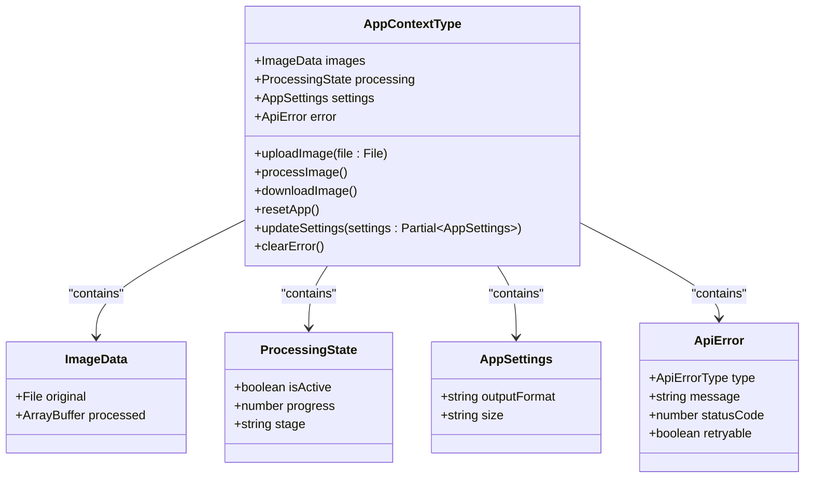
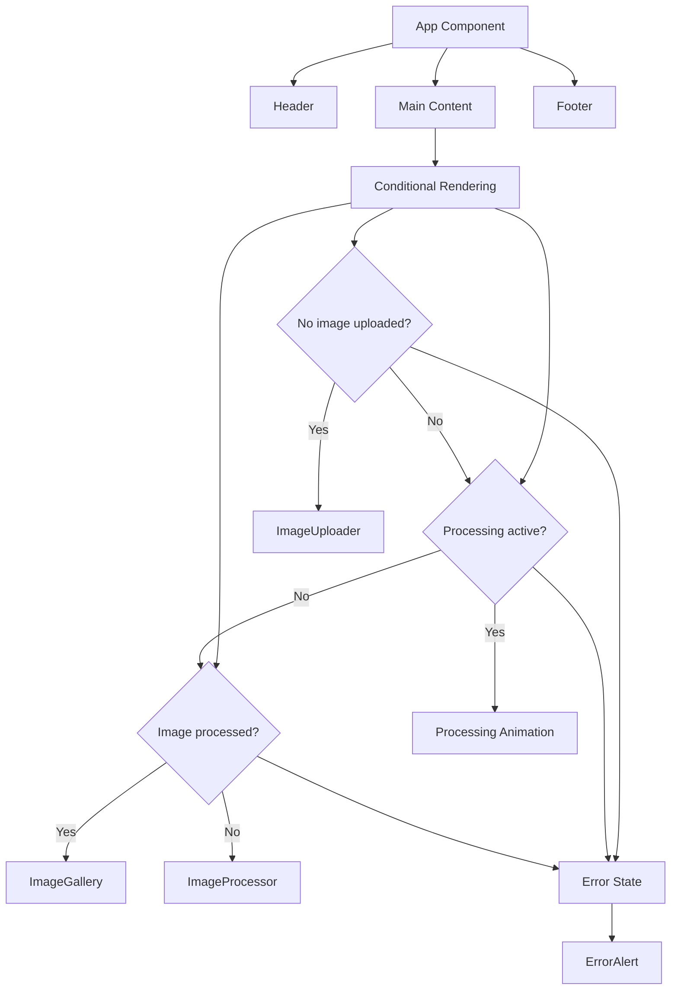

# Component Architecture

<cite>
**Referenced Files in This Document**   
- [App.tsx](../../src/App.tsx)
- [AppContext.tsx](../../src/context/AppContext.tsx)
- [ImageUploader.tsx](../../src/components/ImageUploader.tsx)
- [ImageProcessor.tsx](../../src/components/ImageProcessor.tsx)
- [ImageGallery.tsx](../../src/components/ImageGallery.tsx)
- [ErrorAlert.tsx](../../src/components/ErrorAlert.tsx)
- [Header.tsx](../../src/components/Header.tsx)
- [Footer.tsx](../../src/components/Footer.tsx)
- [index.ts](../../src/types/index.ts)
- [backgroundRemovalService.ts](../../src/services/backgroundRemovalService.ts)
</cite>

## Table of Contents
1. [Container-Component Pattern Overview](#container-component-pattern-overview)
2. [Component Breakdown](#component-breakdown)
3. [State Management and Context Flow](#state-management-and-context-flow)
4. [Component Composition and Layout Structure](#component-composition-and-layout-structure)
5. [Accessibility Features](#accessibility-features)
6. [Animation and Visual Feedback](#animation-and-visual-feedback)
7. [Extensibility and Customization Guidance](#extensibility-and-customization-guidance)

## Container-Component Pattern Overview

The Background Remover application implements a clean container-component pattern where **App.tsx** serves as the orchestrator of application state and component rendering. The container component manages global state through **AppContext.tsx**, which provides a centralized store for image data, processing status, user settings, and error states. Child components remain stateless or manage only local UI state, receiving data and actions via context. This separation enables a unidirectional data flow where user interactions in child components trigger actions that update the global state, causing re-renders across the component tree as needed.

The pattern follows React best practices by isolating business logic in the context provider while keeping presentation logic in individual components. This architecture enhances testability, maintainability, and scalability, as components can be developed and modified independently while maintaining consistent behavior through shared state management.

**Section sources**
- [App.tsx](../../src/App.tsx#L1-L117)
- [AppContext.tsx](../../src/context/AppContext.tsx#L1-L234)

## Component Breakdown

### Header Component
The **Header.tsx** component provides navigation and branding elements at the top of the application. It displays the application logo with decorative icons and includes feature badges that highlight key capabilities like speed and AI-powered processing. The header uses a glassmorphism design with backdrop blur effects and gradient overlays for visual appeal.

**Section sources**
- [Header.tsx](../../src/components/Header.tsx#L1-L49)

### Footer Component
The **Footer.tsx** component contains attribution information, feature highlights, and resource links. It provides access to external documentation and source code while displaying copyright information. The footer uses a similar glassmorphism style to the header, maintaining visual consistency across the application.

**Section sources**
- [Footer.tsx](../../src/components/Footer.tsx#L1-L85)

### ImageUploader Component
The **ImageUploader.tsx** component implements a drag-and-drop interface using **react-dropzone** for file input. It validates files against size (12MB maximum) and format (JPEG, PNG, WEBP) requirements, provides visual feedback during drag operations, and generates preview URLs for selected images. Upon successful upload, it passes file data to **AppContext** via the `uploadImage` action.

When a file is selected, the component displays a preview card showing filename, size, and readiness status, with a clear button to reset the selection. The component handles both drag-and-drop interactions and traditional file browsing, providing accessibility for different user preferences.

**Section sources**
- [ImageUploader.tsx](../../src/components/ImageUploader.tsx#L1-L203)

### ImageProcessor Component
The **ImageProcessor.tsx** component manages the transition between image upload and processing completion. It displays the original image with an overlay showing real-time processing progress when active. The component includes a progress bar with stage indicators (uploading vs. processing) and animated loading elements during API calls.

Users can initiate processing via a prominent action button or choose a different image using the reset functionality. The component conditionally renders based on the presence of an original image and processing state, ensuring appropriate UI presentation at each stage of the workflow.

**Section sources**
- [ImageProcessor.tsx](../../src/components/ImageProcessor.tsx#L1-L185)

### ImageGallery Component
The **ImageGallery.tsx** component displays before/after comparisons of processed images. It offers multiple viewing modes including a slider comparison, side-by-side view, and standalone processed image display. The slider allows users to drag and compare original and processed versions interactively.

The component includes download functionality with visual feedback during the download process and supports resetting the application to process new images. It handles URL creation and cleanup for both original and processed images, preventing memory leaks through proper cleanup in useEffect hooks.

**Section sources**
- [ImageGallery.tsx](../../src/components/ImageGallery.tsx#L1-L242)

### ErrorAlert Component
The **ErrorAlert.tsx** component displays API and validation errors with appropriate icons, colors, and retry functionality. It maps error types to specific visual treatments (e.g., red for API key errors, amber for network issues) and provides contextual retry buttons when appropriate. Users can dismiss errors individually, which clears the error state in the context.

The component supports various error types including invalid API keys, insufficient credits, network errors, and file validation issues, providing specific messaging for each scenario to guide user resolution.

**Section sources**
- [ErrorAlert.tsx](../../src/components/ErrorAlert.tsx#L1-L118)

## State Management and Context Flow

The application uses **React Context** through **AppContext.tsx** to manage global state, following a reducer pattern with well-defined action types. The context exposes both state values and action dispatchers to child components, enabling a clean separation between state logic and presentation.

Key state properties include:
- **images**: Contains original File object and processed ArrayBuffer
- **processing**: Tracks active status, progress percentage, and current stage
- **settings**: Stores user preferences like output format and size
- **error**: Holds ApiError objects with type, message, and retryability

Components interact with the context through the `useApp()` hook, which provides type-safe access to both state and actions. The reducer ensures predictable state transitions with immutable updates, while side effects like API calls are handled within context action implementations.

**Diagram sources**
- [AppContext.tsx](../../src/context/AppContext.tsx#L1-L234)
- [index.ts](../../src/types/index.ts#L1-L50)

**Section sources**
- [AppContext.tsx](../../src/context/AppContext.tsx#L1-L234)
- [index.ts](../../src/types/index.ts#L1-L50)

## Component Composition and Layout Structure

The application uses a hierarchical composition pattern orchestrated by **App.tsx**, which structures the UI into distinct sections: Header, main content area, and Footer. The main content area conditionally renders components based on application state using a state-driven approach.

Layout is implemented using **Flexbox** with Tailwind CSS classes, creating a responsive design that adapts to different screen sizes. The container uses `flex-col` to stack header, main, and footer vertically, with `flex-1` applied to the main section to ensure it expands to fill available space.

Tailwind classes are used extensively for styling:
- **Glassmorphism effects**: `backdrop-blur-md`, `bg-white/80`, `border-white/20`
- **Gradients**: `bg-gradient-to-br`, `from-slate-50`, `to-indigo-50`
- **Elevation**: `shadow-lg`, `shadow-2xl`, `card-elevated` (custom class)
- **Responsive design**: `max-w-7xl`, `px-4 sm:px-6 lg:px-8`, `flex flex-col sm:flex-row`

The composition follows a progressive disclosure pattern, showing components only when relevant to the current workflow stage (upload → process → gallery), reducing cognitive load and guiding users through the process.

**Diagram sources**
- [App.tsx](../../src/App.tsx#L1-L117)

**Section sources**
- [App.tsx](../../src/App.tsx#L1-L117)

## Accessibility Features

The application incorporates several accessibility features to ensure usability for all users:

- **ARIA labels**: Interactive elements include appropriate labels and roles
- **Keyboard navigation**: All buttons and controls are focusable and operable via keyboard
- **Color contrast**: Sufficient contrast ratios for text and interactive elements
- **Focus indicators**: Visible focus states on interactive elements
- **Semantic HTML**: Proper use of heading hierarchy and landmark roles
- **Error messaging**: Clear, descriptive error messages with recovery options

Interactive components include proper hover, focus, and active states with visual feedback. The drag-and-drop interface provides clear visual cues during file operations, and screen reader users receive appropriate feedback through semantic markup and ARIA attributes.

**Section sources**
- [ImageUploader.tsx](../../src/components/ImageUploader.tsx#L1-L203)
- [ImageProcessor.tsx](../../src/components/ImageProcessor.tsx#L1-L185)
- [ImageGallery.tsx](../../src/components/ImageGallery.tsx#L1-L242)

## Animation and Visual Feedback

The application uses **Tailwind transitions** and custom animations to provide visual feedback and enhance user experience:

- **Entrance animations**: Components use `animate-fade-in`, `animate-slide-in`, and `animate-scale-in` classes for smooth appearance
- **Interactive feedback**: Buttons include hover effects with `hover:scale-105`, `hover:shadow-lg`, and color transitions
- **Loading states**: Animated spinners (`animate-spin`), pulsing indicators (`animate-pulse`), and progress animations
- **Micro-interactions**: Icon rotations, background effects, and subtle movements on hover

The ImageUploader provides drag state feedback with border color changes and scale transformations. The processing view includes a dual-ring spinner with reverse animation for visual interest. The download button features a bounce animation during the download process to indicate activity.

These animations are implemented with CSS classes rather than JavaScript, ensuring smooth 60fps performance and respecting user preferences through `prefers-reduced-motion` considerations.

**Section sources**
- [App.tsx](../../src/App.tsx#L1-L117)
- [ImageUploader.tsx](../../src/components/ImageUploader.tsx#L1-L203)
- [ImageProcessor.tsx](../../src/components/ImageProcessor.tsx#L1-L185)

## Extensibility and Customization Guidance

The component architecture supports easy extension and customization:

1. **Adding new features**: New components can be integrated by adding state to AppContext and corresponding actions
2. **Customizing appearance**: Tailwind classes can be modified or extended without changing component logic
3. **Enhancing functionality**: Additional processing options can be added through the settings interface
4. **Integrating new services**: The backgroundRemovalService abstraction allows for alternative API implementations

To extend the application:
- Add new state properties to AppState and AppContextType
- Create corresponding action types in the reducer
- Implement new component features using existing context hooks
- Maintain consistent styling with Tailwind classes
- Ensure accessibility considerations are preserved

The modular design allows components to be reused or repurposed in different contexts, while the centralized state management ensures consistent behavior across the application.

**Section sources**
- [AppContext.tsx](../../src/context/AppContext.tsx#L1-L234)
- [backgroundRemovalService.ts](../../src/services/backgroundRemovalService.ts#L1-L135)
- [index.ts](../../src/types/index.ts#L1-L50)