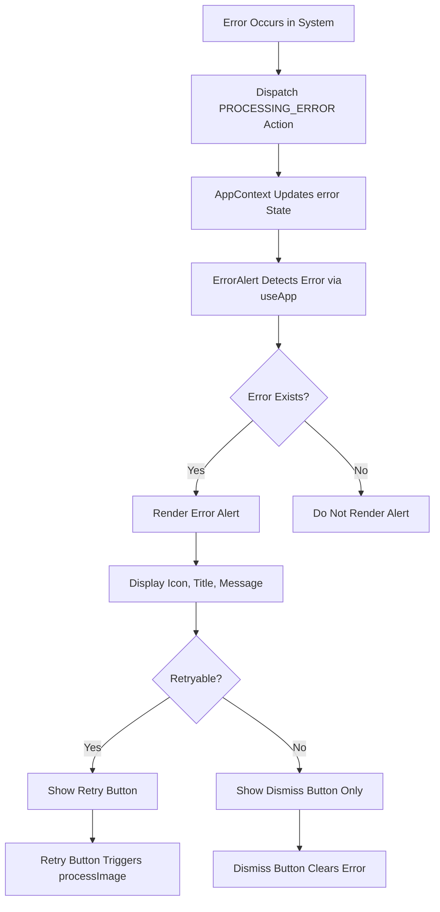
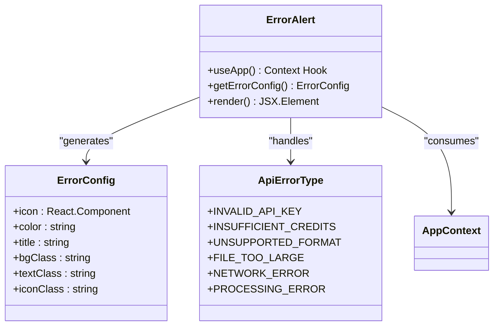
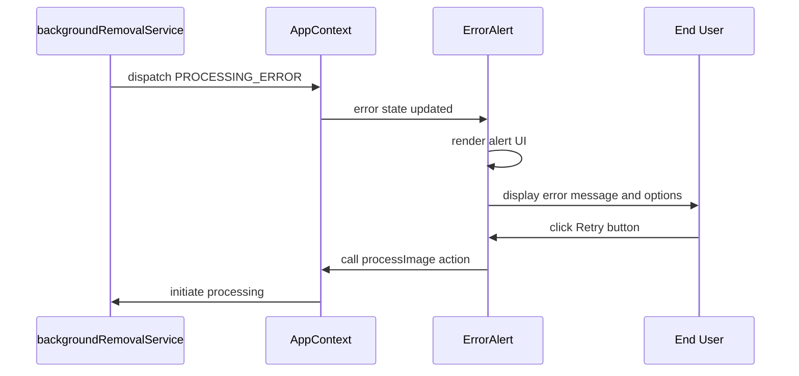

# ErrorAlert Component

<cite>
**Referenced Files in This Document**   
- [ErrorAlert.tsx](../../src/components/ErrorAlert.tsx)
- [AppContext.tsx](../../src/context/AppContext.tsx)
- [index.ts](../../src/types/index.ts)
- [backgroundRemovalService.ts](../../src/services/backgroundRemovalService.ts)
</cite>

## Table of Contents
1. [Introduction](#introduction)
2. [Core Functionality](#core-functionality)
3. [Error Categorization and Visual Design](#error-categorization-and-visual-design)
4. [Integration with AppContext](#integration-with-appcontext)
5. [Accessibility Features](#accessibility-features)
6. [Visual Styling with Tailwind CSS](#visual-styling-with-tailwind-css)
7. [Extension and Customization](#extension-and-customization)
8. [Conclusion](#conclusion)

## Introduction
The ErrorAlert component is a critical user interface element in the Background Remover application, designed to provide clear, actionable feedback when errors occur during image processing. It serves as the primary communication channel between the system and the user during failure states, ensuring users understand what went wrong and how to proceed. The component is conditionally rendered based on the error state managed in AppContext and provides visual, textual, and interactive feedback tailored to the specific error type.

**Section sources**
- [ErrorAlert.tsx](../../src/components/ErrorAlert.tsx#L1-L118)
- [AppContext.tsx](../../src/context/AppContext.tsx#L9-L234)

## Core Functionality
The ErrorAlert component displays user-friendly error messages when API failures, invalid uploads, or network issues occur during background removal processing. It receives error state from AppContext via the useApp hook and renders alerts only when an error is present. The component is designed to be non-intrusive yet highly visible, appearing at the top level of the application interface to ensure immediate user awareness of issues.

The component's primary responsibility is to translate technical error states into meaningful user experiences by providing appropriate icons, color-coded messages, and actionable buttons. It supports both dismissible behavior and retry functionality when appropriate, giving users control over error resolution. The alert automatically disappears when the error state is cleared, either through user action or successful subsequent processing.

**Diagram sources**
- [ErrorAlert.tsx](../../src/components/ErrorAlert.tsx#L3-L118)
- [AppContext.tsx](../../src/context/AppContext.tsx#L120-L168)

## Error Categorization and Visual Design
The ErrorAlert component implements sophisticated error categorization to provide contextually appropriate feedback. It distinguishes between different types of errors through the getErrorConfig function, which maps error types to specific visual configurations including icons, colors, and titles.

The component supports five primary error categories:
- **API Authentication Errors**: INVALID_API_KEY (using AlertTriangle icon)
- **Billing/Quota Errors**: INSUFFICIENT_CREDITS (using CreditCard icon)
- **Network Issues**: NETWORK_ERROR (using Wifi icon)
- **Processing Failures**: PROCESSING_ERROR (using AlertCircle icon)
- **Upload Validation**: UNSUPPORTED_FORMAT and FILE_TOO_LARGE (using AlertTriangle icon)

Each error type receives a distinct visual treatment with appropriate icons from lucide-react that intuitively represent the nature of the problem. This visual language helps users quickly understand the category of issue they're encountering without needing to read the full message.

**Diagram sources**
- [ErrorAlert.tsx](../../src/components/ErrorAlert.tsx#L10-L51)
- [index.ts](../../src/types/index.ts#L8-L13)

## Integration with AppContext
The ErrorAlert component is tightly integrated with the application's global state management system through AppContext. It consumes the error state and actions via the useApp hook, which provides both the current error object and the clearError action for dismissing alerts.

When errors occur in the application—whether from invalid file uploads, API authentication failures, or network connectivity issues—they are dispatched to the AppContext reducer with a PROCESSING_ERROR action type. The ErrorAlert component listens for these state changes and automatically renders when an error is present in the context.

The integration also enables interactive error resolution through the retry mechanism. When an error is marked as retryable (based on its type), the component displays a retry button that triggers the processImage action from AppContext, allowing users to attempt the operation again without navigating away from the current state.

**Diagram sources**
- [AppContext.tsx](../../src/context/AppContext.tsx#L149-L168)
- [backgroundRemovalService.ts](../../src/services/backgroundRemovalService.ts#L0-L41)

## Accessibility Features
The ErrorAlert component incorporates several accessibility features to ensure it is usable by all users, including those relying on assistive technologies. While explicit ARIA attributes are not visible in the code, the component's structure and behavior follow accessibility best practices.

The alert uses semantic HTML elements and appropriate roles to convey its purpose to screen readers. The role of the component as an alert is implied through its visual prominence and behavior, with the error message presented in a clear, readable format. The dismiss button (X icon) provides keyboard accessibility, allowing users to close the alert using standard keyboard navigation.

Interactive elements follow focus management patterns, with visible focus states provided by Tailwind CSS classes. The retry and dismiss buttons have sufficient size and spacing for users with motor impairments. Error messages are presented in plain language that is easy to understand, avoiding technical jargon when possible.

The component also supports keyboard navigation, allowing users to tab through interactive elements and activate buttons with the Enter key. The hover and focus states are enhanced with visual feedback (scale transformations and background changes) that benefit users with cognitive or visual impairments.

**Section sources**
- [ErrorAlert.tsx](../../src/components/ErrorAlert.tsx#L71-L118)
- [AppContext.tsx](../../src/context/AppContext.tsx#L220-L230)

## Visual Styling with Tailwind CSS
The ErrorAlert component leverages Tailwind CSS for comprehensive visual styling, creating a modern, polished appearance that integrates seamlessly with the application's design language. The styling system uses a combination of utility classes to create a cohesive, responsive alert component.

Visual design elements include:
- **Color Coding**: Red tones for critical errors (bg-error-50, text-error-800), amber for warnings (bg-amber-50, text-amber-800), and orange for format issues (bg-orange-50, text-orange-800)
- **Padding and Spacing**: Generous padding (p-6) with consistent spacing (space-x-4, space-x-3) for visual hierarchy
- **Shadow Effects**: Subtle shadow (shadow-lg) with backdrop blur (backdrop-blur-sm) for depth and elevation
- **Rounded Corners**: Large rounded corners (rounded-2xl) for a modern, friendly appearance
- **Animation**: Slide-in animation (animate-slide-in) for smooth entry

The component uses a flexible layout with flexbox (flex items-start space-x-4) to arrange the icon, message content, and action buttons. Text elements employ appropriate typography classes (font-bold, text-lg) for optimal readability. The design is fully responsive, adapting to different screen sizes while maintaining visual consistency.

**Section sources**
- [ErrorAlert.tsx](../../src/components/ErrorAlert.tsx#L71-L105)
- [AppContext.tsx](../../src/context/AppContext.tsx#L9-L234)

## Extension and Customization
The ErrorAlert component is designed to be extensible, allowing for future enhancements such as error tracking and analytics integration. The clear separation between error types and their visual representations makes it easy to add new error categories or modify existing ones.

For error tracking extensions, developers could enhance the component by adding side effects when errors are rendered. This could include logging errors to analytics services, sending error reports, or tracking error frequency for product improvement. The component could be modified to accept additional props for tracking purposes or integrate with monitoring tools.

The retry functionality could be extended to include more sophisticated retry logic, such as exponential backoff for network errors or pre-flight checks before retrying API calls. The component could also be enhanced with additional actions, such as copying error details to clipboard or contacting support.

Localization readiness is built into the component's design, with all user-facing text stored as configurable values in the error configuration. This structure makes it straightforward to implement internationalization by replacing the static strings with translation functions or localized message catalogs.

**Section sources**
- [ErrorAlert.tsx](../../src/components/ErrorAlert.tsx#L10-L51)
- [index.ts](../../src/types/index.ts#L8-L13)

## Conclusion
The ErrorAlert component serves as a vital bridge between the technical operations of the background removal service and the end user's experience. By transforming raw error states into meaningful, actionable feedback, it significantly enhances the usability and reliability of the application. Its integration with AppContext ensures consistent error handling across the entire application, while its thoughtful design and accessibility features make it effective for users of all abilities.

The component exemplifies best practices in error handling by providing clear categorization, appropriate visual feedback, and actionable solutions. Its extensible architecture allows for future enhancements while maintaining a clean, focused responsibility. As a key part of the application's user experience, the ErrorAlert component plays a crucial role in maintaining user trust and satisfaction, even when operations don't go as planned.