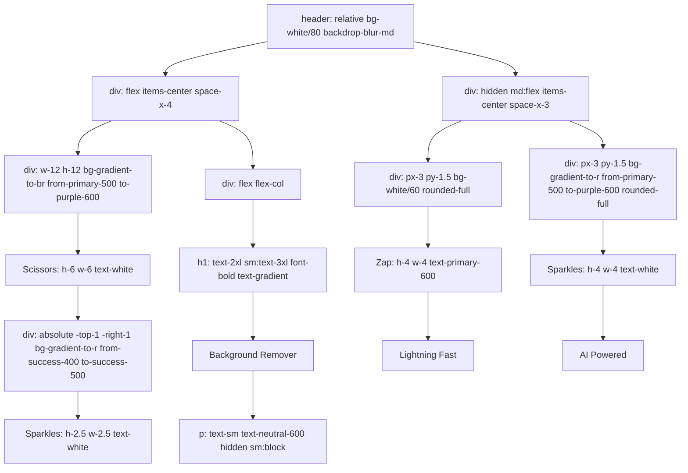
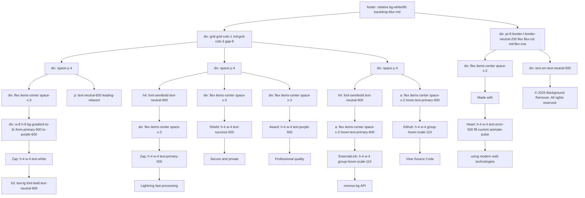
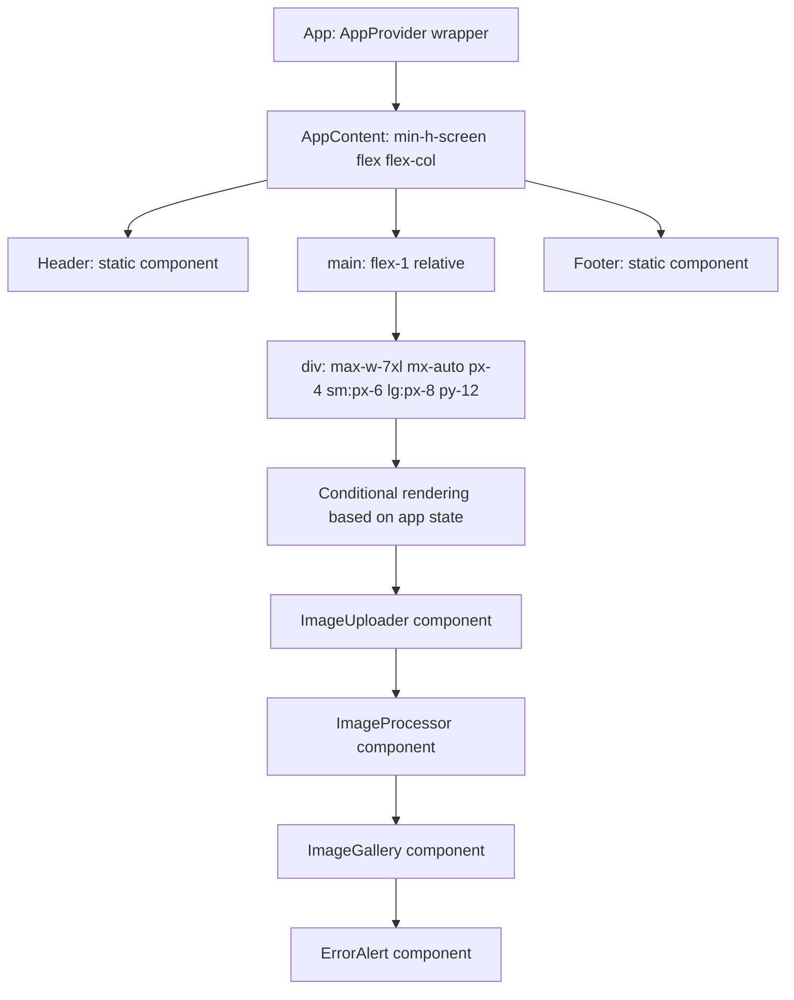

# Header and Footer Components

<cite>
**Referenced Files in This Document**   
- [Header.tsx](../../src/components/Header.tsx)
- [Footer.tsx](../../src/components/Footer.tsx)
- [App.tsx](../../src/App.tsx)
- [index.css](../../src/index.css)
</cite>

## Table of Contents
1. [Introduction](#introduction)
2. [Header Component](#header-component)
3. [Footer Component](#footer-component)
4. [Layout Integration](#layout-integration)
5. [Accessibility Features](#accessibility-features)
6. [Customization Options](#customization-options)
7. [Internationalization and SEO](#internationalization-and-seo)
8. [Future Enhancements](#future-enhancements)
9. [Conclusion](#conclusion)

## Introduction
The Header and Footer components serve as essential structural elements in the Background Remover application, providing consistent branding, navigation, and attribution across the interface. These static components are implemented using modern React patterns with Tailwind CSS for styling, leveraging Flexbox for layout and semantic HTML for accessibility. This document details their implementation, functionality, and integration within the application's main layout.

## Header Component

The Header component establishes the application's identity and provides immediate visual cues about its capabilities. It features a custom logo with dynamic iconography, the application title, and feature badges that highlight key benefits.

### Branding and Navigation Structure
The Header uses a flexbox layout to align branding elements on the left and feature indicators on the right. The primary branding consists of a gradient circular icon containing a scissors symbol, representing the core functionality of background removal. A secondary sparkle icon in the corner signifies AI-powered processing. The application title "Background Remover" is displayed prominently with a gradient text effect, followed by a tagline that appears on larger screens: "AI-Powered • Instant • Professional".

### Implementation Details
The component leverages Tailwind's utility classes for responsive design, using different text sizes and visibility rules across screen sizes. The header container uses transparency with backdrop blur to create a glass-morphism effect, overlaying a subtle gradient background. Feature badges on medium screens and above display "Lightning Fast" and "AI Powered" with appropriate icons, reinforcing the application's value proposition.

**Diagram sources**
- [Header.tsx](../../src/components/Header.tsx#L1-L49)

**Section sources**
- [Header.tsx](../../src/components/Header.tsx#L1-L49)

## Footer Component

The Footer component provides attribution, feature highlights, and external resource links, creating a professional closing to the user experience. It maintains visual consistency with the Header through similar styling patterns while serving informational purposes.

### Content Structure and Layout
The Footer uses a responsive grid layout that adapts from three columns on desktop to a single column on mobile. The first column contains brand information with a smaller version of the application icon and a brief description of the tool's capabilities. The second column highlights key features with icons representing speed, security, and quality. The third column contains external links to the remove.bg API documentation and the project's source code repository on GitHub.

### Responsive Design and Spacing
The component employs Tailwind's responsive grid system (grid-cols-1 md:grid-cols-3) to reorganize content based on screen size. Each section maintains consistent vertical spacing (space-y-4) and horizontal alignment. The bottom section includes copyright information and an animated heart icon that pulses to convey the developer's passion for the project. External links include visual feedback on hover with color transitions and subtle scaling effects.

**Diagram sources**
- [Footer.tsx](../../src/components/Footer.tsx#L1-L85)

**Section sources**
- [Footer.tsx](../../src/components/Footer.tsx#L1-L85)

## Layout Integration

Both Header and Footer components are integrated into the main application layout through the App.tsx file, which serves as the root component orchestrating the overall page structure.

### Static Component Integration
The components are implemented as static elements within the AppContent functional component, positioned at the top and bottom of the flex column layout. The main container uses a flexbox structure with flex-col direction, allowing the Header to remain fixed at the top, the main content area to expand flexibly, and the Footer to stay anchored at the bottom (mt-auto). This ensures consistent placement regardless of content length.

### Semantic HTML Structure
The implementation follows semantic HTML principles with proper use of header and footer elements. The layout container uses a gradient background defined in Tailwind, while the maximum width is constrained to 7xl with responsive padding (px-4 sm:px-6 lg:px-8) to ensure content remains readable across devices. The Header and Footer both include decorative background gradients that extend behind the content for visual interest.

**Diagram sources**
- [App.tsx](../../src/App.tsx#L1-L117)

**Section sources**
- [App.tsx](../../src/App.tsx#L1-L117)

## Accessibility Features

The Header and Footer components incorporate several accessibility features to ensure usability for all users, following modern web accessibility standards.

### Semantic Structure and Navigation
Both components use appropriate semantic HTML elements: header for the Header component and footer for the Footer component. This provides structural meaning to assistive technologies and helps users understand the page organization. The heading hierarchy is maintained with h1 in the Header and h3/h4 elements in the Footer, creating a logical document outline.

### Focus Management and Visual Feedback
Interactive elements in the Footer (external links) have proper focus visibility through Tailwind's focus-visible utilities. The global styles in index.css define a clear focus ring (outline: 2px solid var(--primary-500)) with offset, ensuring keyboard navigation is visible. All icons are accompanied by text labels, providing context for screen reader users.

### Color Contrast and Typography
The components maintain sufficient color contrast between text and background, using Tailwind's neutral color palette with appropriate contrast ratios. The typography system leverages relative units and responsive text sizing (text-2xl sm:text-3xl) to ensure readability across devices. The gradient text effect on the application title is implemented with background-clip: text and -webkit-background-clip: text, preserving the underlying text for accessibility tools.

**Section sources**
- [Header.tsx](../../src/components/Header.tsx#L1-L49)
- [Footer.tsx](../../src/components/Footer.tsx#L1-L85)
- [index.css](../../src/index.css#L136-L202)

## Customization Options

The Header and Footer components are designed with customization in mind, allowing for easy modification of branding, styling, and content while maintaining the overall design system.

### Logo and Branding Replacement
The application logo can be easily replaced by modifying the icon within the circular gradient container. The current implementation uses the Scissors icon from Lucide React, but this can be substituted with a custom SVG or image. The gradient colors (from-primary-500 to-purple-600) can be adjusted through Tailwind's color configuration or by directly modifying the class names.

### Color Theme Customization
The components leverage Tailwind's color system, making theme changes straightforward. The primary color palette is defined in index.css using CSS variables (--color-primary-50 through --color-primary-900), which can be modified to implement different color schemes. Alternatively, Tailwind's built-in color classes can be replaced with different color names (e.g., from-blue-500 to-red-500) for quick theme changes.

### Navigation Extension
While currently minimal, the Header could be extended to include additional navigation items. The flexbox layout provides a natural container for navigation links that could be added to the right side of the header, alongside or instead of the current feature badges. These could include user account links, documentation, or other application sections.

**Section sources**
- [Header.tsx](../../src/components/Header.tsx#L1-L49)
- [Footer.tsx](../../src/components/Footer.tsx#L1-L85)
- [index.css](../../src/index.css#L0-L47)

## Internationalization and SEO

The static nature of the Header and Footer components presents both opportunities and considerations for internationalization and search engine optimization.

### Internationalization Potential
The text content in both components is currently hardcoded in English, but could be adapted for internationalization by implementing a translation system. The application title, tagline, feature descriptions, and footer content could be extracted into language files and dynamically loaded based on user preferences or browser settings. The component structure supports this pattern, as the text elements are clearly separated from the layout and styling.

### SEO Considerations
The Header component includes important SEO elements with its h1 heading containing the primary keyword "Background Remover." This helps search engines understand the page's purpose. The Footer provides additional context with feature descriptions and external links, which can contribute to the site's overall SEO profile. The semantic structure with proper header and footer elements also contributes to better page indexing.

### Static Content Optimization
Since these components are static, their content is immediately available to search engine crawlers without requiring JavaScript execution. The text is not generated dynamically, ensuring consistent indexing. The use of standard HTML elements and clear hierarchy supports accessibility and SEO best practices.

**Section sources**
- [Header.tsx](../../src/components/Header.tsx#L1-L49)
- [Footer.tsx](../../src/components/Footer.tsx#L1-L85)

## Future Enhancements

The current implementation of the Header and Footer components provides a solid foundation that can be extended with additional functionality in future versions.

### User Controls in Header
The Header could be enhanced to include user-specific controls when authentication is implemented. This might include a user profile dropdown, settings icon, or account management links. The current right-aligned space for feature badges could accommodate these elements, or they could be integrated into a navigation menu that appears on user interaction.

### Dynamic Footer Content
The Footer could be made more dynamic by including version information, status indicators, or user feedback links. The current static attribution could be supplemented with dynamic content such as the current application version or links to recent updates. This would provide users with additional context about the tool they are using.

### Responsive Behavior Improvements
Future versions could implement a sticky or fixed positioning for the Header on scroll, ensuring navigation remains accessible as users interact with content. The Footer could also include additional social media links or community engagement options to foster user connection with the development team.

**Section sources**
- [Header.tsx](../../src/components/Header.tsx#L1-L49)
- [Footer.tsx](../../src/components/Footer.tsx#L1-L85)

## Conclusion
The Header and Footer components in the Background Remover application effectively establish brand identity, provide essential information, and create a polished user interface. Implemented with React and Tailwind CSS, they demonstrate modern web development practices with responsive design, accessibility considerations, and clean code organization. Their static integration into the main layout through App.tsx ensures consistency across the application, while their structure allows for future enhancements and customization. These components serve as excellent examples of how to balance visual appeal with functionality and accessibility in a modern web application.