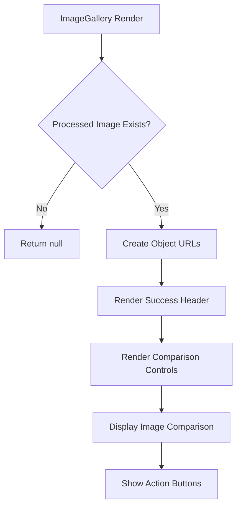
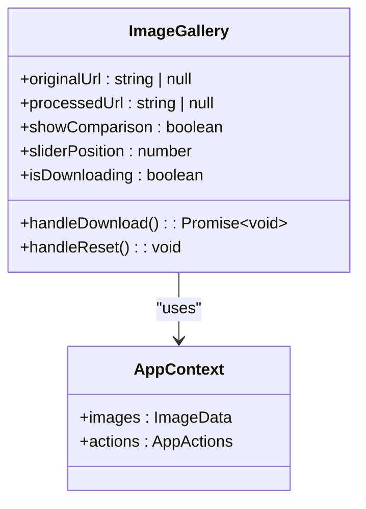
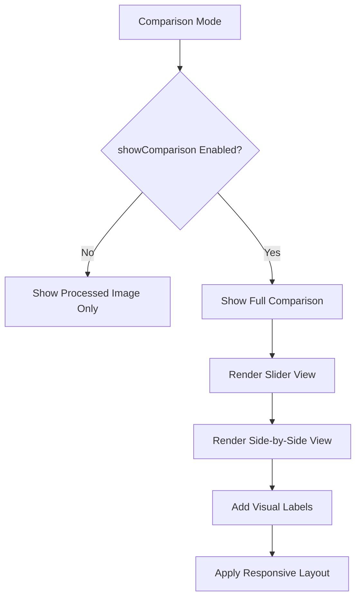
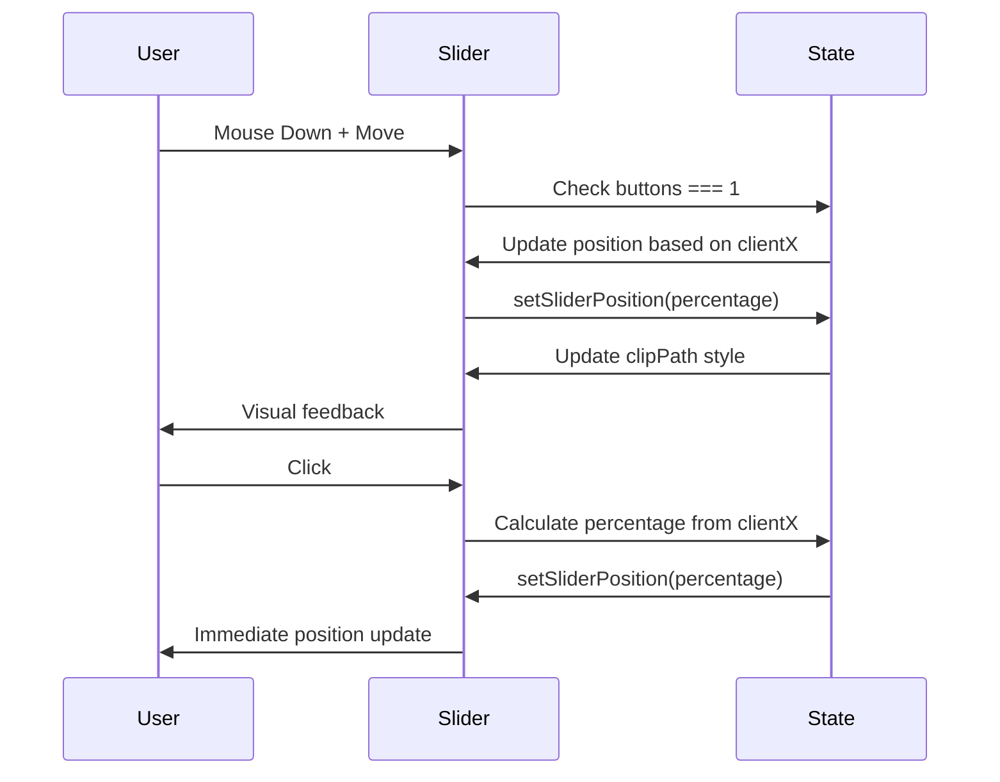
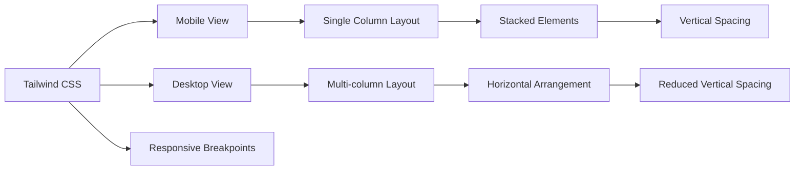
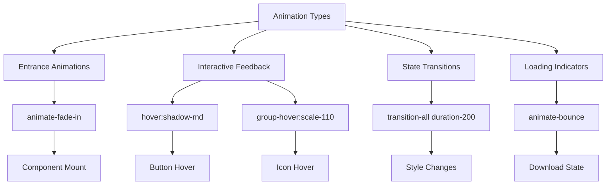
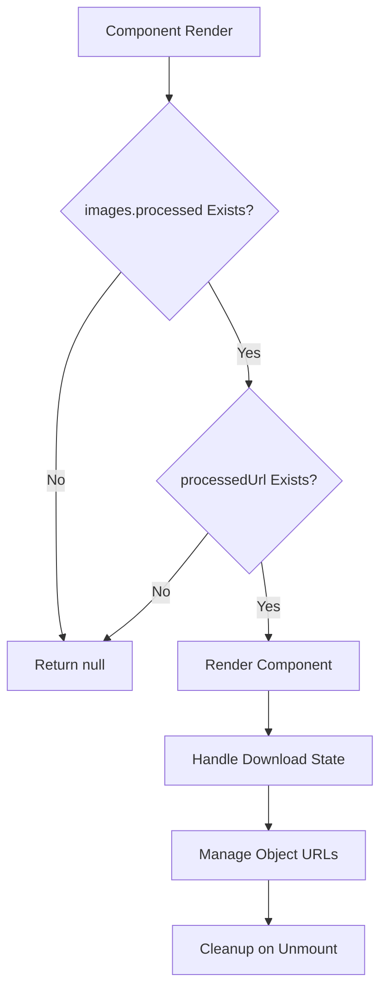
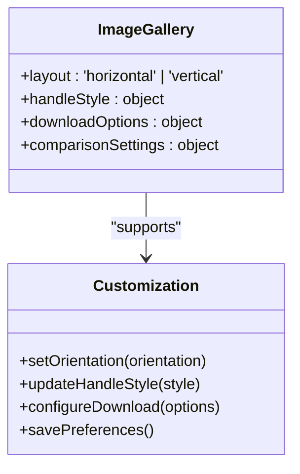

# ImageGallery Component

<cite>
**Referenced Files in This Document**   
- [ImageGallery.tsx](../../src/components/ImageGallery.tsx)
- [AppContext.tsx](../../src/context/AppContext.tsx)
- [backgroundRemovalService.ts](../../src/services/backgroundRemovalService.ts)
- [index.ts](../../src/types/index.ts)
</cite>

## Table of Contents
1. [Introduction](#introduction)
2. [Core Functionality](#core-functionality)
3. [State Management and Context Integration](#state-management-and-context-integration)
4. [Before/After Comparison Interface](#beforeafter-comparison-interface)
5. [Interactive Slider Implementation](#interactive-slider-implementation)
6. [Responsive Design with Tailwind CSS](#responsive-design-with-tailwind-css)
7. [Accessibility Considerations](#accessibility-considerations)
8. [Animation and Transition Patterns](#animation-and-transition-patterns)
9. [Error Handling and Edge Cases](#error-handling-and-edge-cases)
10. [Customization and Extensibility](#customization-and-extensibility)

## Introduction

The ImageGallery component serves as the final presentation layer in the background removal application, displaying processed images with professional-quality before/after comparison capabilities. It enables users to visually verify the results of background removal processing and provides intuitive controls for downloading and resetting the workflow. The component leverages React's state management, AppContext integration, and Tailwind CSS for responsive, accessible, and interactive image comparison.

**Section sources**
- [ImageGallery.tsx](../../src/components/ImageGallery.tsx#L1-L243)

## Core Functionality

The ImageGallery component renders a success state when image processing completes, displaying both original and processed images for comparison. It conditionally renders content only when processed image data exists, ensuring a clean user experience. The component creates object URLs for both original and processed images using `URL.createObjectURL()`, which are automatically cleaned up through cleanup functions in useEffect hooks to prevent memory leaks.

Key features include:
- Visual confirmation of successful background removal
- Toggleable comparison view between original and processed images
- Download functionality for processed images
- Reset capability to start a new processing workflow



**Diagram sources**
- [ImageGallery.tsx](../../src/components/ImageGallery.tsx#L39-L243)

**Section sources**
- [ImageGallery.tsx](../../src/components/ImageGallery.tsx#L39-L243)

## State Management and Context Integration

The component integrates with AppContext to access image data and application actions. It extracts images and actions from the context using the `useApp()` hook, enabling access to original and processed image data as well as download and reset functionality. The component maintains local state for comparison visibility, slider position, and download status.

State variables include:
- `originalUrl`: Object URL for the original image
- `processedUrl`: Object URL for the processed image
- `showComparison`: Boolean flag for comparison view visibility
- `sliderPosition`: Percentage value (0-100) for the comparison slider
- `isDownloading`: Flag indicating active download state



**Diagram sources**
- [ImageGallery.tsx](../../src/components/ImageGallery.tsx#L6-L15)
- [AppContext.tsx](../../src/context/AppContext.tsx#L131-L134)

**Section sources**
- [ImageGallery.tsx](../../src/components/ImageGallery.tsx#L6-L38)
- [AppContext.tsx](../../src/context/AppContext.tsx#L42-L49)

## Before/After Comparison Interface

The component provides a sophisticated before/after comparison interface that allows users to evaluate the quality of background removal. When comparison mode is enabled, it displays both original and processed images using a split-view layout with a draggable slider. The interface includes two complementary views: an interactive slider comparison and a side-by-side comparison.

The comparison interface features:
- A primary slider view with real-time before/after visualization
- Secondary side-by-side view for detailed inspection
- Visual labels identifying original and processed images
- Responsive layout that adapts to different screen sizes



**Diagram sources**
- [ImageGallery.tsx](../../src/components/ImageGallery.tsx#L97-L214)

**Section sources**
- [ImageGallery.tsx](../../src/components/ImageGallery.tsx#L97-L214)

## Interactive Slider Implementation

The interactive slider enables users to dynamically compare original and processed images by revealing portions of each image based on slider position. The implementation uses CSS `clipPath` to mask the processed image, with the clipping boundary controlled by the `sliderPosition` state. Mouse event handlers enable both click-to-position and drag-to-adjust functionality.

Key implementation details:
- `clipPath` CSS property with `inset()` function to create the split view
- Mouse move detection for drag interactions when primary button is pressed
- Click handling for quick positioning of the slider
- Visual slider handle with cursor feedback
- Background checkerboard pattern to highlight transparency



**Diagram sources**
- [ImageGallery.tsx](../../src/components/ImageGallery.tsx#L116-L137)

**Section sources**
- [ImageGallery.tsx](../../src/components/ImageGallery.tsx#L116-L137)

## Responsive Design with Tailwind CSS

The component implements responsive design principles using Tailwind CSS utility classes, ensuring optimal usability across devices. The layout adapts to different screen sizes through flexbox and grid systems, with specific breakpoints for mobile, tablet, and desktop views.

Responsive features include:
- Mobile-first design approach
- Flexbox for header actions with `flex-col sm:flex-row`
- Grid layout for side-by-side comparison with `grid-cols-1 md:grid-cols-2`
- Responsive spacing with Tailwind's gap and padding utilities
- Adaptive typography with responsive text sizing



**Diagram sources**
- [ImageGallery.tsx](../../src/components/ImageGallery.tsx#L70-L71)

**Section sources**
- [ImageGallery.tsx](../../src/components/ImageGallery.tsx#L70-L71)

## Accessibility Considerations

The component incorporates several accessibility features to ensure usability for all users, including those with disabilities. It follows web accessibility best practices through semantic HTML, proper contrast ratios, and keyboard navigation support.

Accessibility features:
- Descriptive alt text for all images
- Sufficient color contrast between text and background
- Keyboard-accessible buttons with proper focus states
- Semantic HTML structure with appropriate heading levels
- Visual indicators for interactive elements
- Screen reader-friendly icons with proper labeling

```mermaid
flowchart TD
A[Accessibility Features] --> B[Alternative Text]
A --> C[Color Contrast]
A --> D[Keyboard Navigation]
A --> E[Focus States]
A --> F[Semantic Structure]
A --> G[Screen Reader Support]
B --> H[alt="Original"]
B --> I[alt="Processed"]
C --> J[Text: #1F2937 on #FFFFFF]
D --> K[Tab Navigation]
E --> L[Focus Rings]
F --> M[Proper Heading Hierarchy]
G --> N[Icon Labels]
```

**Diagram sources**
- [ImageGallery.tsx](../../src/components/ImageGallery.tsx#L148-L149)

**Section sources**
- [ImageGallery.tsx](../../src/components/ImageGallery.tsx#L148-L149)

## Animation and Transition Patterns

The component utilizes Tailwind CSS transitions and animations to provide smooth user experience and visual feedback. It implements various animation patterns for state changes, loading indicators, and interactive elements.

Animation features include:
- `animate-fade-in` for component entrance
- `animate-bounce` during download process
- Hover effects with `hover:scale-110` and `hover:shadow-md`
- Button state transitions with `transition-all duration-200`
- Icon animations with `group-hover:rotate-180`



**Diagram sources**
- [ImageGallery.tsx](../../src/components/ImageGallery.tsx#L42-L43)

**Section sources**
- [ImageGallery.tsx](../../src/components/ImageGallery.tsx#L42-L43)

## Error Handling and Edge Cases

The component gracefully handles various edge cases and error conditions to maintain a robust user experience. It implements conditional rendering based on the availability of processed image data and provides appropriate fallback behavior.

Handled edge cases:
- Missing processed image data (returns null)
- Failed image loading (handled by browser img element)
- Download process state management
- Memory management for object URLs
- Context availability validation



**Diagram sources**
- [ImageGallery.tsx](../../src/components/ImageGallery.tsx#L39-L41)

**Section sources**
- [ImageGallery.tsx](../../src/components/ImageGallery.tsx#L39-L41)

## Customization and Extensibility

The component architecture allows for various customization options and potential enhancements. While the current implementation focuses on horizontal split comparison, the design can be extended to support additional layout variations and features.

Potential customization options:
- Layout orientation (horizontal/vertical split)
- Handle styling and size
- Comparison mode persistence
- Download format options
- Image quality settings
- Integration with additional export formats



**Diagram sources**
- [ImageGallery.tsx](../../src/components/ImageGallery.tsx#L12-L14)

**Section sources**
- [ImageGallery.tsx](../../src/components/ImageGallery.tsx#L12-L14)