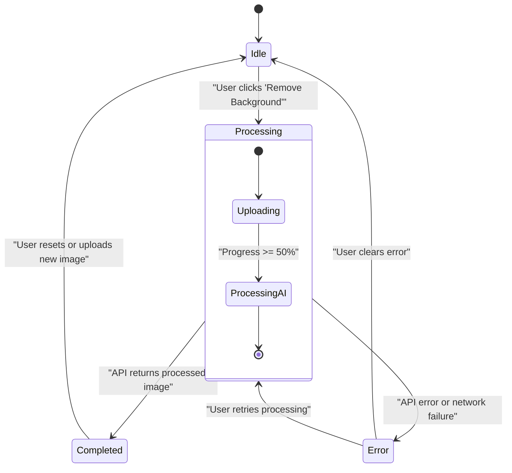
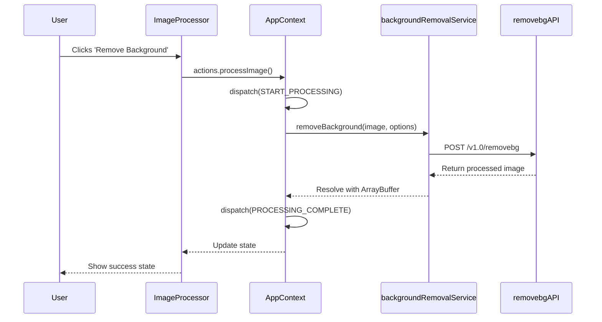
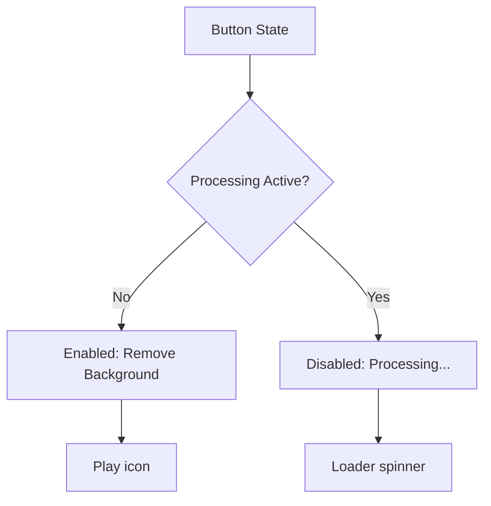
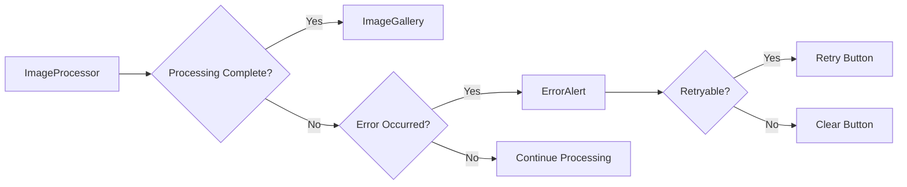
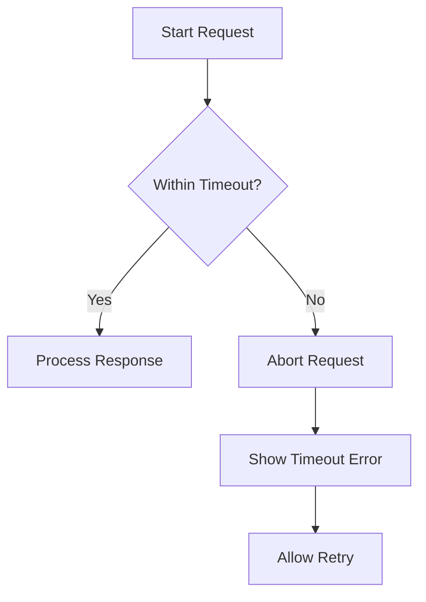

# ImageProcessor Component

## Table of Contents
1. [Introduction](#introduction)
2. [Core Functionality](#core-functionality)
3. [State Management and Processing Flow](#state-management-and-processing-flow)
4. [UI Elements and User Interaction](#ui-elements-and-user-interaction)
5. [Error Handling and Success Flow](#error-handling-and-success-flow)
6. [Accessibility Features](#accessibility-features)
7. [Performance Considerations](#performance-considerations)
8. [Extension Guidance](#extension-guidance)

## Introduction
The ImageProcessor component serves as the central control interface for initiating and managing background removal operations in the application. It provides users with a visually engaging interface to trigger AI-powered background removal, monitor processing progress, and manage image processing workflows. The component integrates tightly with the application's global state management system and external API services to deliver a seamless user experience.

## Core Functionality

The ImageProcessor component orchestrates the background removal process by coordinating between the user interface, application state, and external API services. It acts as the primary interface for users to initiate processing after uploading an image through the ImageUploader component.

When a user uploads an image, the ImageProcessor becomes visible and provides the necessary controls to start the background removal process. The component reads the API key and image data from the AppContext state, which is managed through React Context and useReducer for predictable state transitions.

The core functionality revolves around triggering API calls through the backgroundRemovalService, which communicates with the remove.bg API to perform the actual background removal. The component handles the entire lifecycle of the processing operation, from initiation to completion or error states.

**Section sources**
- [ImageProcessor.tsx](../../src/components/ImageProcessor.tsx#L1-L185)
- [AppContext.tsx](../../src/context/AppContext.tsx#L120-L168)

## State Management and Processing Flow

The ImageProcessor component leverages React's useReducer hook through the AppContext to manage complex state transitions during the background removal process. The component monitors and responds to four distinct processing states: idle, processing, completed, and error.

**Diagram sources**
- [AppContext.tsx](../../src/context/AppContext.tsx#L52-L124)
- [ImageProcessor.tsx](../../src/components/ImageProcessor.tsx#L47-L94)

The state transitions are managed through specific action types defined in the AppContext:

- **START_PROCESSING**: Initiates the processing workflow, setting `isActive` to true and progress to 0
- **UPDATE_PROGRESS**: Updates the progress percentage and determines the current stage (uploading vs. processing)
- **PROCESSING_COMPLETE**: Handles successful completion, storing the processed image data
- **PROCESSING_ERROR**: Manages error states with appropriate error categorization

The component integrates with useReducer actions to set processing status and handle responses. When the user clicks the "Remove Background" button, the `handleProcess` function calls `actions.processImage()`, which dispatches the appropriate actions to update the application state.

**Diagram sources**
- [AppContext.tsx](../../src/context/AppContext.tsx#L120-L168)
- [backgroundRemovalService.ts](../../src/services/backgroundRemovalService.ts#L0-L41)

## UI Elements and User Interaction

The ImageProcessor component features several key UI elements designed to provide clear feedback and intuitive controls:

### Remove Background Button
The primary action button displays different states based on the processing status:
- **Idle state**: Shows "Remove Background" with a play icon
- **Processing state**: Displays "Processing..." with a loading spinner
- **Disabled state**: Grayed out during processing to prevent duplicate submissions

**Diagram sources**
- [ImageProcessor.tsx](../../src/components/ImageProcessor.tsx#L120-L142)

### Loading Spinner and Progress Indicators
During processing, an overlay displays an advanced loading animation with multiple visual elements:
- Dual animated spinners with different speeds and directions
- Pulsing lightning bolt icon at the center
- Dynamic progress percentage display
- Stage-specific messaging ("Uploading Image..." or "AI Processing...")
- Visual progress bar with gradient effects
- Step indicators showing upload and processing stages

The progress bar uses the processing.progress value from the AppContext state to dynamically update its width, providing users with real-time feedback on the operation's status.

**Section sources**
- [ImageProcessor.tsx](../../src/components/ImageProcessor.tsx#L47-L94)

## Error Handling and Success Flow

The ImageProcessor component implements a comprehensive error handling system that integrates with the ErrorAlert component for user feedback. When processing errors occur, the component propagates errors to the ErrorAlert, which displays appropriate messages based on the error type.

Error types handled include:
- **INVALID_API_KEY**: Invalid or missing API credentials
- **INSUFFICIENT_CREDITS**: Account has exceeded processing limits
- **UNSUPPORTED_FORMAT**: File format not supported
- **FILE_TOO_LARGE**: File exceeds 12MB limit
- **NETWORK_ERROR**: Connection issues or timeout
- **PROCESSING_ERROR**: General processing failures

Upon successful completion, the flow transitions to the ImageGallery component, which displays the processed image with comparison tools and download options. The state transition from processing to completed triggers the rendering of the ImageGallery instead of the ImageProcessor.

**Diagram sources**
- [ErrorAlert.tsx](../../src/components/ErrorAlert.tsx#L71-L105)
- [ImageGallery.tsx](../../src/components/ImageGallery.tsx#L35-L52)

## Accessibility Features

The ImageProcessor component incorporates several accessibility features to ensure usability for all users:

### Screen Reader Announcements
- ARIA labels on interactive elements
- Status updates during processing stages
- Clear labeling of buttons and controls
- Semantic HTML structure for screen reader navigation

### Keyboard Operability
- Full keyboard navigation support
- Focus management for interactive elements
- Accessible button controls with proper tab indexing
- Keyboard shortcuts for common actions

The component ensures that all visual feedback is accompanied by programmatic indicators that assistive technologies can interpret, providing equal access to processing status and controls.

**Section sources**
- [ImageProcessor.tsx](../../src/components/ImageProcessor.tsx#L120-L142)
- [AppContext.tsx](../../src/context/AppContext.tsx#L120-L168)

## Performance Considerations

The ImageProcessor component and its associated services implement several performance optimizations:

### Request Debouncing
The component prevents rapid successive processing requests by disabling the "Remove Background" button during active processing. This ensures that only one request is processed at a time, preventing API rate limit issues and unnecessary resource consumption.

### Timeout Handling
The backgroundRemovalService implements a 30-second timeout for API requests using AbortController. This prevents hanging requests and provides a better user experience by failing fast rather than leaving users waiting indefinitely.

**Diagram sources**
- [backgroundRemovalService.ts](../../src/services/backgroundRemovalService.ts#L0-L41)

### Memory Management
The component properly manages memory by:
- Creating object URLs for image previews
- Revoking object URLs when components unmount or images change
- Preventing memory leaks from accumulated object URL references

## Extension Guidance

The ImageProcessor component can be extended to support additional processing options:

### Image Quality Settings
Add controls for adjusting output quality parameters by extending the AppSettings interface and updating the backgroundRemovalService to accept quality parameters.

### Format Conversion Options
Implement format conversion options by enhancing the UI with format selection controls and updating the RemovalOptions type definition.

### Advanced Processing Options
Extend functionality by adding support for:
- Subject type detection (person, product, auto)
- Custom background colors for JPG output
- Resolution presets beyond the current auto, preview, and full options
- Batch processing capabilities

These extensions would require corresponding updates to the AppContext state management, UI controls in the ImageProcessor, and parameter handling in the backgroundRemovalService.

**Section sources**
- [index.ts](../../src/types/index.ts#L0-L50)
- [AppContext.tsx](../../src/context/AppContext.tsx#L0-L50)
- [backgroundRemovalService.ts](../../src/services/backgroundRemovalService.ts#L0-L41)