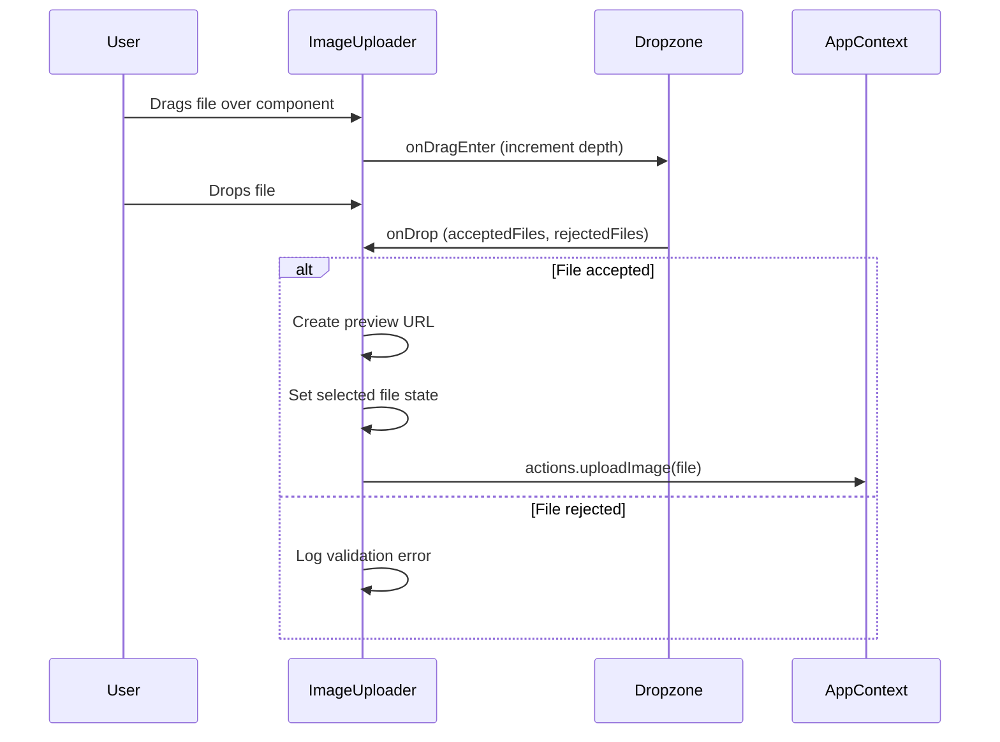
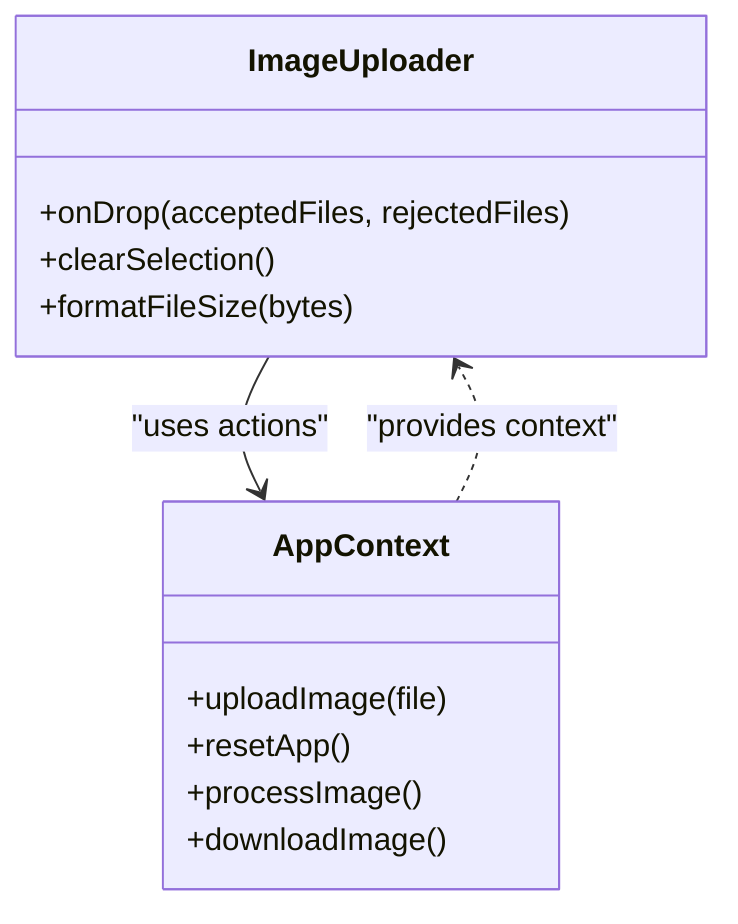
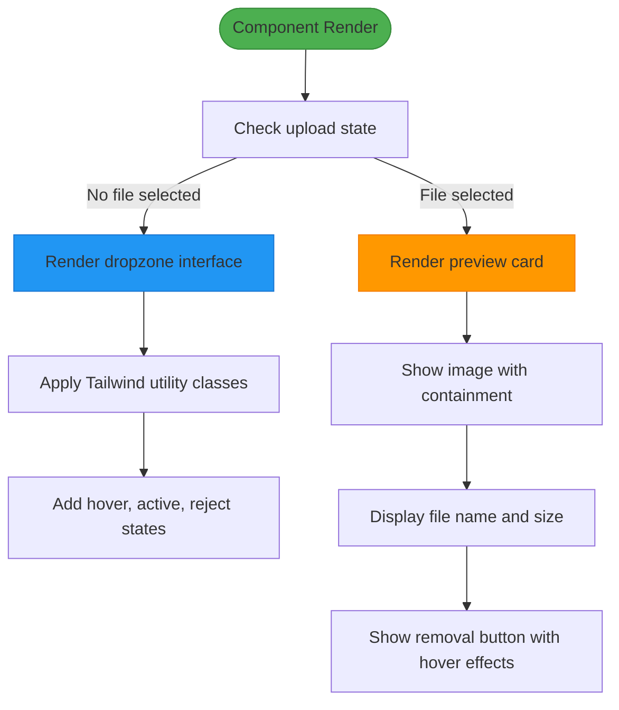

# ImageUploader Component

<cite>
**Referenced Files in This Document**   
- [ImageUploader.tsx](../../src/components/ImageUploader.tsx)
- [AppContext.tsx](../../src/context/AppContext.tsx)
- [index.ts](../../src/types/index.ts)
- [App.css](../../src/App.css)
- [index.css](../../src/index.css)
</cite>

## Table of Contents
1. [Introduction](#introduction)
2. [Core Implementation](#core-implementation)
3. [File Validation and Client-Side Checks](#file-validation-and-client-side-checks)
4. [Integration with AppContext](#integration-with-appcontext)
5. [UI Feedback and Accessibility](#ui-feedback-and-accessibility)
6. [Styling with Tailwind CSS](#styling-with-tailwind-css)
7. [Error Handling and User Feedback](#error-handling-and-user-feedback)
8. [Customization and Extension Points](#customization-and-extension-points)
9. [Performance and Security Considerations](#performance-and-security-considerations)

## Introduction
The ImageUploader component provides a modern, user-friendly interface for uploading images via drag-and-drop or click-to-browse interactions. Built using `react-dropzone`, it supports client-side validation for file types and sizes, integrates with the application's global state via `AppContext`, and delivers rich visual feedback using Tailwind CSS and animated effects.

**Section sources**
- [ImageUploader.tsx](../../src/components/ImageUploader.tsx#L1-L203)

## Core Implementation
The component leverages `useDropzone` from `react-dropzone` to manage file input interactions. It supports both drag-and-drop and traditional file browsing through a hidden input field controlled by the dropzone. The component maintains local state for the selected file and its preview URL, while dispatching the actual file to the global context for processing.

Key implementation details:
- Uses `useCallback` to memoize the `onDrop` handler and prevent unnecessary re-renders
- Creates object URLs for image previews using `URL.createObjectURL()`
- Manages drag depth state to track nested drag events
- Implements file clearing with proper cleanup of object URLs



**Diagram sources**
- [ImageUploader.tsx](../../src/components/ImageUploader.tsx#L39-L63)
- [AppContext.tsx](../../src/context/AppContext.tsx#L170-L234)

**Section sources**
- [ImageUploader.tsx](../../src/components/ImageUploader.tsx#L0-L37)

## File Validation and Client-Side Checks
The component enforces strict client-side validation to ensure only appropriate files are processed:

- **Accepted formats**: JPEG, PNG, and WebP images only
- **Size limit**: Maximum 12MB per file
- **Single file**: Only one image can be uploaded at a time

The validation configuration is defined as:
```typescript
const ACCEPTED_FORMATS = {
  'image/jpeg': ['.jpg', '.jpeg'],
  'image/png': ['.png'],
  'image/webp': ['.webp']
};
const MAX_FILE_SIZE = 12 * 1024 * 1024; // 12MB
```

When invalid files are dropped, the component accesses the rejection reasons through `rejectedFiles[0].errors[0]` and logs the validation error message without proceeding with upload.

**Section sources**
- [ImageUploader.tsx](../../src/components/ImageUploader.tsx#L0-L37)
- [ImageUploader.tsx](../../src/components/ImageUploader.tsx#L39-L63)

## Integration with AppContext
The ImageUploader component integrates with the global application state through `AppContext`, using the `useApp()` hook to access dispatch actions. This enables centralized state management for image processing workflows.

Key integration points:
- On successful file drop: `actions.uploadImage(file)` dispatches the file to global state
- On file removal: `actions.resetApp()` clears all application state
- State synchronization: The component responds to global state changes through context subscription

The `AppContext` defines the `uploadImage` action that updates the `images.original` state property and triggers any dependent components (like ImageProcessor) to update their UI.



**Diagram sources**
- [ImageUploader.tsx](../../src/components/ImageUploader.tsx#L0-L37)
- [AppContext.tsx](../../src/context/AppContext.tsx#L0-L50)

**Section sources**
- [ImageUploader.tsx](../../src/components/ImageUploader.tsx#L0-L37)
- [AppContext.tsx](../../src/context/AppContext.tsx#L170-L234)

## UI Feedback and Accessibility
The component provides comprehensive visual and interactive feedback to enhance user experience:

### Visual States
- **Default**: Dashed border with subtle hover effects
- **Drag active**: Glassmorphism effect with primary border and shadow
- **Drag reject**: Glassmorphism effect with error border and shadow
- **Selected**: Preview card with file metadata and removal option

### Interactive Feedback
- **Hover states**: Scale transformation and background gradient fade-in
- **Loading indicators**: Bounce animation during drag-over state
- **File preview**: Image display with overlay effects on hover
- **Removal**: Clear button with hover scale effect and shadow enhancement

### Accessibility Features
- Proper ARIA roles through `react-dropzone` integration
- Keyboard support for file input (click-to-browse)
- Focus management via Tailwind's focus-ring utilities
- Semantic HTML structure with appropriate heading levels
- Screen reader-friendly error messages

**Section sources**
- [ImageUploader.tsx](../../src/components/ImageUploader.tsx#L106-L135)
- [App.css](../../src/App.css#L0-L49)

## Styling with Tailwind CSS
The component uses Tailwind CSS for responsive layout and visual styling, with custom utilities defined in the global CSS files.

### Key Styling Features
- **Responsive design**: `max-w-2xl mx-auto` centers the component with appropriate width
- **Glassmorphism**: Custom `.glass-card` class with backdrop blur and border
- **Gradient backgrounds**: Multiple gradient effects for depth and visual interest
- **Smooth animations**: Transition classes for hover effects and state changes
- **Custom components**: Defined in CSS layers for consistent UI patterns

### Animation System
The component leverages CSS custom properties and Tailwind's animation system:
- `animate-fade-in` and `animate-scale-in` for entrance effects
- `animate-bounce-soft` for active drag state feedback
- `transition-all duration-300` for smooth state changes
- `transform hover:scale-[1.02]` for subtle hover magnification



**Diagram sources**
- [ImageUploader.tsx](../../src/components/ImageUploader.tsx#L106-L135)
- [index.css](../../src/index.css#L94-L139)

**Section sources**
- [ImageUploader.tsx](../../src/components/ImageUploader.tsx#L106-L135)
- [index.css](../../src/index.css#L94-L202)

## Error Handling and User Feedback
The component provides immediate feedback for invalid file uploads through visual and textual cues:

### Validation Feedback
- **Visual**: Red border and error-themed dropzone when invalid files are dragged
- **Textual**: Dynamic heading changes to "Invalid file type or size"
- **Console**: Error messages logged for debugging purposes

### Error Types Handled
- **Unsupported formats**: Files not matching JPEG, PNG, or WebP MIME types
- **Oversized files**: Files exceeding 12MB limit
- **Multiple files**: Attempting to upload more than one file

The component could be extended to show user-facing error messages by integrating with the `ErrorAlert` component and dispatching appropriate error types (`UNSUPPORTED_FORMAT`, `FILE_TOO_LARGE`) to the global context.

**Section sources**
- [ImageUploader.tsx](../../src/components/ImageUploader.tsx#L0-L37)
- [index.ts](../../src/types/index.ts#L0-L50)

## Customization and Extension Points
The ImageUploader component can be customized and extended in several ways:

### Configuration Customization
- **Accepted formats**: Modify the `ACCEPTED_FORMATS` object to include additional MIME types
- **Size limits**: Adjust the `MAX_FILE_SIZE` constant for different size requirements
- **Multiple files**: Change `multiple: false` to `true` in useDropzone options

### Feature Extensions
- **Thumbnail previews**: Add a thumbnail grid for multiple image uploads
- **File type icons**: Display different icons based on file type
- **Progress indicators**: Show upload progress for large files
- **Metadata display**: Show additional file information (dimensions, EXIF data)

### Integration Extensions
- **Validation feedback**: Connect to global error state to display user-friendly messages
- **Drag-and-drop zones**: Create multiple drop zones for different file types
- **Auto-processing**: Automatically trigger processing after upload completion

**Section sources**
- [ImageUploader.tsx](../../src/components/ImageUploader.tsx#L0-L203)

## Performance and Security Considerations
The component addresses several performance and security aspects:

### Performance
- **Memory management**: Proper cleanup of object URLs using `URL.revokeObjectURL()`
- **State optimization**: Use of `useCallback` to prevent unnecessary re-renders
- **Preview efficiency**: Object URLs provide efficient image preview without base64 encoding
- **Event handling**: Efficient drag depth tracking without excessive re-renders

### Security
- **Client-side validation**: Immediate feedback without server round-trips
- **File type enforcement**: MIME type checking in addition to extension validation
- **Size limits**: Prevention of excessively large file uploads
- **Context isolation**: File objects passed through context without modification

### Browser Compatibility
- **Modern browsers**: Full support for all features
- **Legacy browsers**: Object URL and CSS backdrop-filter may require polyfills
- **Mobile**: Touch-friendly interface with appropriate tap targets

**Section sources**
- [ImageUploader.tsx](../../src/components/ImageUploader.tsx#L0-L203)
- [AppContext.tsx](../../src/context/AppContext.tsx#L0-L234)