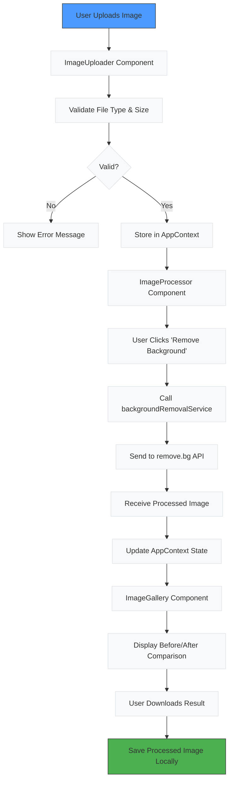

# Project Overview

<cite>
**Referenced Files in This Document**   
- [README.md](../../README.md)
- [App.tsx](../../src/App.tsx)
- [AppContext.tsx](../../src/context/AppContext.tsx)
- [backgroundRemovalService.ts](../../src/services/backgroundRemovalService.ts)
- [ImageUploader.tsx](../../src/components/ImageUploader.tsx)
- [ImageProcessor.tsx](../../src/components/ImageProcessor.tsx)
- [ImageGallery.tsx](../../src/components/ImageGallery.tsx)
- [types/index.ts](../../src/types/index.ts)
</cite>

## Table of Contents
1. [Introduction](#introduction)
2. [Purpose and Use Cases](#purpose-and-use-cases)
3. [Technology Stack](#technology-stack)
4. [User Workflow](#user-workflow)
5. [Architecture Overview](#architecture-overview)
6. [State Management](#state-management)
7. [Application Flow Diagram](#application-flow-diagram)

## Introduction

The Background Remover application is a modern React-based frontend tool designed to simplify the process of removing image backgrounds using the remove.bg API. This document provides a high-level overview of the application's purpose, architecture, and functionality, setting the foundation for deeper technical exploration in subsequent sections.

## Purpose and Use Cases

The Background Remover serves as an intuitive web interface for leveraging AI-powered background removal technology. Its primary purpose is to enable users to transform ordinary images into professional-quality assets with transparent backgrounds, eliminating the need for complex photo editing software.

Key use cases include:
- **E-commerce**: Prepare product images with clean, transparent backgrounds for online stores
- **Portrait Editing**: Remove distracting backgrounds from personal or professional portraits
- **Social Media Content Creation**: Create engaging visuals with isolated subjects for platforms like Instagram, TikTok, and Facebook
- **Graphic Design**: Generate assets for presentations, marketing materials, and digital compositions

The application emphasizes ease of use, providing immediate visual feedback and one-click processing to make professional image editing accessible to users of all skill levels.

**Section sources**
- [README.md](../../README.md#L1-L20)
- [App.tsx](../../src/App.tsx#L1-L20)

## Technology Stack

The application leverages a modern web development stack to deliver a responsive and performant user experience:

- **React**: Component-based UI framework for building interactive interfaces
- **Vite**: Next-generation frontend build tool for fast development and optimized production builds
- **Tailwind CSS**: Utility-first CSS framework enabling rapid, consistent styling
- **TypeScript**: Typed superset of JavaScript providing enhanced code quality and developer experience

Additional key technologies include:
- **react-dropzone**: For intuitive drag-and-drop file uploads
- **Lucide React**: Lightweight icon library for visual elements
- **remove.bg API**: Cloud-based AI service for background removal processing

This technology combination ensures a fast, reliable, and maintainable application that works seamlessly across desktop and mobile devices.

**Section sources**
- [README.md](../../README.md#L100-L120)
- [package.json](../../package.json#L1-L50)

## User Workflow

The user experience follows a straightforward four-step process:

1. **Upload**: Users can upload an image through drag-and-drop or file browsing. The ImageUploader component handles file validation, ensuring only supported formats (JPEG, PNG, WEBP) under 12MB are accepted.

2. **Process**: After uploading, users click "Remove Background" to initiate processing. The ImageProcessor component manages the API integration, displaying real-time progress updates during the background removal operation.

3. **View Results**: The ImageGallery component presents the processed image with multiple viewing options, including before/after comparison sliders and side-by-side views to showcase the transformation.

4. **Download**: Users can download the processed image with a transparent background in PNG format, ready for immediate use in their projects.

Throughout this workflow, the application provides clear visual feedback, error handling, and intuitive controls to guide users through each step.

**Section sources**
- [ImageUploader.tsx](../../src/components/ImageUploader.tsx#L1-L50)
- [ImageProcessor.tsx](../../src/components/ImageProcessor.tsx#L1-L50)
- [ImageGallery.tsx](../../src/components/ImageGallery.tsx#L1-L50)

## Architecture Overview

The application follows a component-based architecture with clear separation of concerns:

- **Components**: Reusable UI elements like ImageUploader, ImageProcessor, and ImageGallery handle specific user interface functions
- **Context**: AppContext provides global state management using React Context API with useReducer for predictable state transitions
- **Services**: backgroundRemovalService encapsulates API integration logic, abstracting the remove.bg API interaction
- **Types**: Centralized TypeScript interfaces define data structures and ensure type safety throughout the application

This architecture promotes maintainability and scalability, with each layer having well-defined responsibilities and interfaces.

**Section sources**
- [App.tsx](../../src/App.tsx#L1-L50)
- [AppContext.tsx](../../src/context/AppContext.tsx#L1-L50)
- [backgroundRemovalService.ts](../../src/services/backgroundRemovalService.ts#L1-L50)

## State Management

The application utilizes React Context with useReducer for comprehensive state management through the AppContext. The global state model includes:

- **images**: Stores both original and processed image data
- **processing**: Tracks processing status, progress percentage, and current stage
- **settings**: Maintains user preferences for output format and size
- **error**: Handles API errors with structured error types and messages

The AppContext exposes actions like uploadImage, processImage, and downloadImage that components use to interact with the state. This centralized approach ensures consistent state updates and enables seamless communication between components without prop drilling.

**Section sources**
- [AppContext.tsx](../../src/context/AppContext.tsx#L1-L100)
- [types/index.ts](../../src/types/index.ts#L1-L50)

## Application Flow Diagram

**Diagram sources**
- [ImageUploader.tsx](../../src/components/ImageUploader.tsx#L1-L204)
- [ImageProcessor.tsx](../../src/components/ImageProcessor.tsx#L1-L186)
- [ImageGallery.tsx](../../src/components/ImageGallery.tsx#L1-L243)
- [AppContext.tsx](../../src/context/AppContext.tsx#L1-L235)
- [backgroundRemovalService.ts](../../src/services/backgroundRemovalService.ts#L1-L136)

**Section sources**
- [AppContext.tsx](../../src/context/AppContext.tsx#L1-L235)
- [backgroundRemovalService.ts](../../src/services/backgroundRemovalService.ts#L1-L136)
- [ImageUploader.tsx](../../src/components/ImageUploader.tsx#L1-L204)
- [ImageProcessor.tsx](../../src/components/ImageProcessor.tsx#L1-L186)
- [ImageGallery.tsx](../../src/components/ImageGallery.tsx#L1-L243)