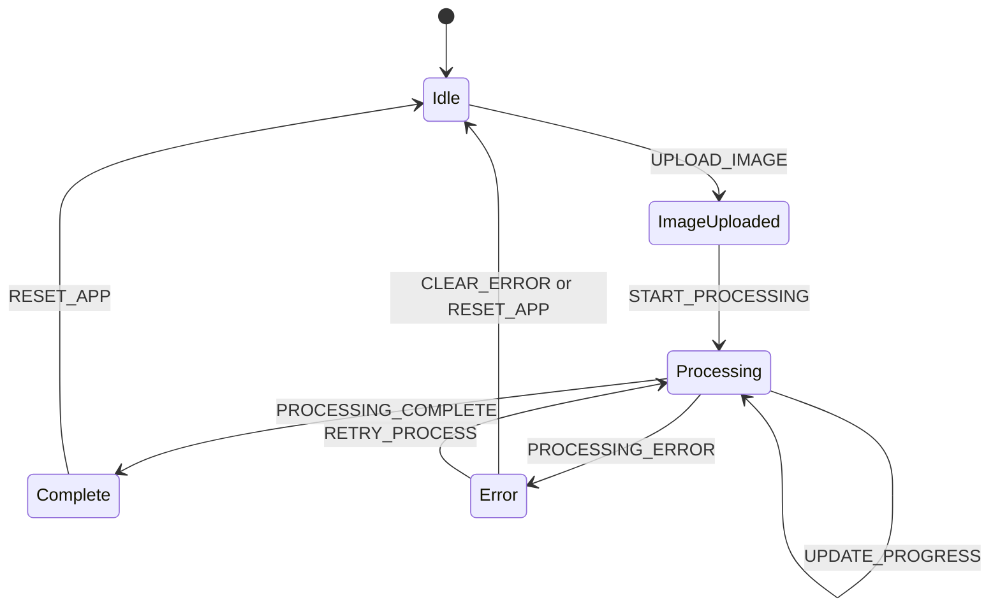

# State Management

## Table of Contents
1. [Introduction](#introduction)
2. [AppState Interface and Centralized State](#appstate-interface-and-centralized-state)
3. [Reducer Function and Action Handling](#reducer-function-and-action-handling)
4. [AppContext and Global State Access](#appcontext-and-global-state-access)
5. [Data Flow: Image Upload and Processing](#data-flow-image-upload-and-processing)
6. [State Transition Diagram](#state-transition-diagram)
7. [Consuming Context in Components](#consuming-context-in-components)
8. [Why Context + useReducer Over Alternatives](#why-context--usereducer-over-alternatives)
9. [Best Practices: Avoiding Unnecessary Re-renders](#best-practices-avoiding-unnecessary-re-renders)
10. [Scalability and Future Migration Paths](#scalability-and-future-migration-paths)

## Introduction
This document provides a comprehensive overview of the state management system in the Background Remover application. The system is built using React Context and the useReducer hook to manage global application state in a predictable and maintainable way. It centralizes image data, processing status, user settings, and error states, enabling seamless coordination across components such as image uploaders, processors, and galleries.

## AppState Interface and Centralized State

The `AppState` interface, defined in `AppContext.tsx`, serves as the single source of truth for the application's state. It encapsulates all critical data needed during the image processing workflow:

- **images**: Contains both the original uploaded `File` and the processed `ArrayBuffer`
- **processing**: Tracks progress with `isActive`, `progress` percentage, and current `stage`
- **settings**: Stores user preferences like output format and image size
- **error**: Holds structured error information via the `ApiError` type

This centralized structure ensures that all components access consistent, up-to-date state without prop drilling or external state management libraries.

**Section sources**
- [AppContext.tsx](../../src/context/AppContext.tsx#L17-L30)
- [index.ts](../../src/types/index.ts#L30-L50)

## Reducer Function and Action Handling

The `appReducer` function handles all state transitions in response to dispatched actions. It uses a switch statement to process the following action types:

- **UPLOAD_IMAGE**: Sets the original image and resets processed image and error
- **START_PROCESSING**: Initiates processing state with 0% progress
- **UPDATE_PROGRESS**: Updates progress and dynamically changes stage based on percentage
- **PROCESSING_COMPLETE**: Stores the processed image and finalizes state
- **PROCESSING_ERROR**: Sets error object and stops processing
- **UPDATE_SETTINGS**: Merges new settings with existing ones
- **RESET_APP**: Returns all state to initial values
- **CLEAR_ERROR**: Removes any active error

Each case returns a new state object using spread syntax to ensure immutability, preventing unintended side effects.

**Section sources**
- [AppContext.tsx](../../src/context/AppContext.tsx#L52-L124)

## AppContext and Global State Access

`AppContext` provides global access to both state and dispatch functions through the `AppProvider` wrapper. The context value, typed as `AppContextType`, exposes:

- Readable state properties: `images`, `processing`, `settings`, `error`
- Action methods: `uploadImage`, `processImage`, `downloadImage`, `resetApp`, `updateSettings`, `clearError`

The `AppProvider` wraps the entire application in `App.tsx`, making the context available to all child components. This pattern enables deep component trees to access and modify state without intermediate props.

**Section sources**
- [AppContext.tsx](../../src/context/AppContext.tsx#L126-L234)
- [App.tsx](../../src/App.tsx#L110-L116)

## Data Flow: Image Upload and Processing

When a user uploads an image:
1. `ImageUploader` calls `actions.uploadImage(file)`
2. Dispatch triggers `UPLOAD_IMAGE` action in reducer
3. State updates with the new file, triggering re-render

When processing begins:
1. `ImageProcessor` calls `actions.processImage()`
2. Dispatch sends `START_PROCESSING` and simulates progress via `UPDATE_PROGRESS`
3. `backgroundRemovalService.removeBackground()` is called with current settings
4. On success: `PROCESSING_COMPLETE` stores result
5. On failure: `PROCESSING_ERROR` sets appropriate error

The UI responds to state changes by showing loading indicators, result previews, or error alerts.

**Section sources**
- [AppContext.tsx](../../src/context/AppContext.tsx#L130-L170)
- [ImageUploader.tsx](../../src/components/ImageUploader.tsx#L20-L30)
- [ImageProcessor.tsx](../../src/components/ImageProcessor.tsx#L15-L20)

## State Transition Diagram

**Diagram sources**
- [AppContext.tsx](../../src/context/AppContext.tsx#L52-L124)

## Consuming Context in Components

Components consume the context using the custom `useApp()` hook, which wraps `useContext(AppContext)` and includes safety checks. Examples include:

- `ImageUploader`: Uses `actions.uploadImage()` and `actions.resetApp()`
- `ImageProcessor`: Calls `actions.processImage()` and `actions.resetApp()`
- `ImageGallery`: Accesses `images.processed` and uses `actions.downloadImage()`
- `ErrorAlert`: Reads `error` to display messages

This pattern abstracts direct context usage, improving type safety and reducing boilerplate.

**Section sources**
- [ImageUploader.tsx](../../src/components/ImageUploader.tsx#L10-L15)
- [ImageProcessor.tsx](../../src/components/ImageProcessor.tsx#L5-L10)
- [ImageGallery.tsx](../../src/components/ImageGallery.tsx#L5-L10)
- [AppContext.tsx](../../src/context/AppContext.tsx#L230-L234)

## Why Context + useReducer Over Alternatives

Context + useReducer was chosen over Redux or other state managers due to:

- **Simplicity**: No need for middleware, store setup, or action creators
- **Built-in React Features**: Leverages native React patterns
- **TypeScript Integration**: Excellent type inference with TypeScript
- **Bundle Size**: Avoids adding external dependencies
- **Performance**: Sufficient for medium-sized state trees with proper memoization

For this application’s scope—single workflow, moderate state complexity—this approach offers optimal balance between functionality and maintainability.

**Section sources**
- [AppContext.tsx](../../src/context/AppContext.tsx#L1-L234)

## Best Practices: Avoiding Unnecessary Re-renders

To prevent performance issues:
- **Memoized Actions**: Action functions are stable across renders due to `useReducer`
- **Selective Context Usage**: Components only destructure needed state values
- **useCallback**: Event handlers that call actions are wrapped in `useCallback`
- **Derived State**: `stage` is computed from `progress`, reducing stored state
- **Blob URL Cleanup**: `useEffect` cleanup prevents memory leaks in preview URLs

These practices ensure efficient rendering even during intensive operations like progress updates.

**Section sources**
- [AppContext.tsx](../../src/context/AppContext.tsx#L130-L234)
- [ImageGallery.tsx](../../src/components/ImageGallery.tsx#L20-L35)

## Scalability and Future Migration Paths

As the application grows, potential enhancements include:
- **Modular Reducers**: Split `appReducer` into smaller reducers (e.g., `imageReducer`, `uiReducer`)
- **Middleware Pattern**: Add logging or persistence via higher-order reducer functions
- **Zustand Migration**: For complex async logic or devtools, migrate to lightweight stores
- **Redux Toolkit**: If team familiarity or ecosystem tools become necessary
- **Context Splitting**: Separate concerns into multiple contexts (e.g., `SettingsContext`, `ImageContext`)

Currently, the unified context model remains optimal for cohesion and simplicity.

**Section sources**
- [AppContext.tsx](../../src/context/AppContext.tsx#L1-L234)
- [index.ts](../../src/types/index.ts#L1-L50)