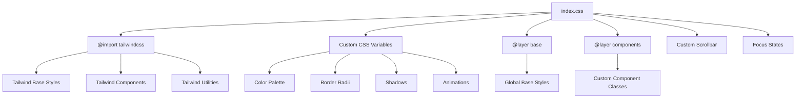
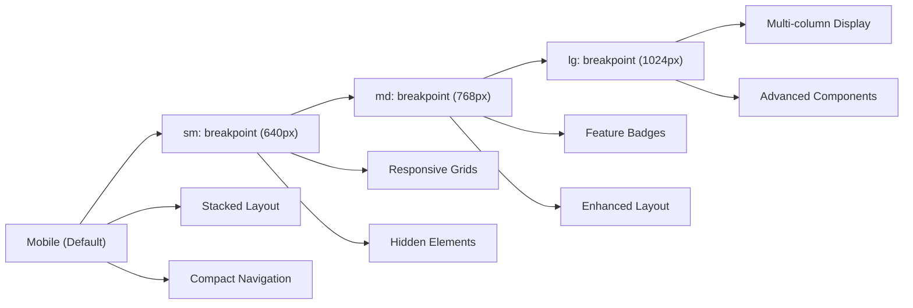
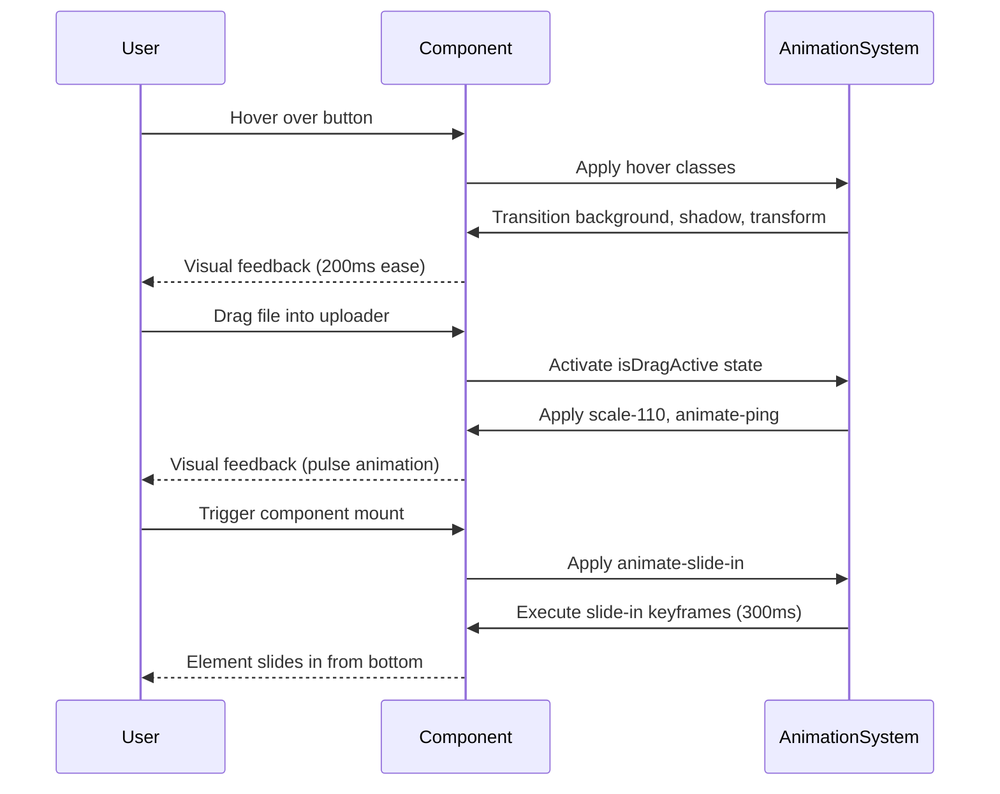
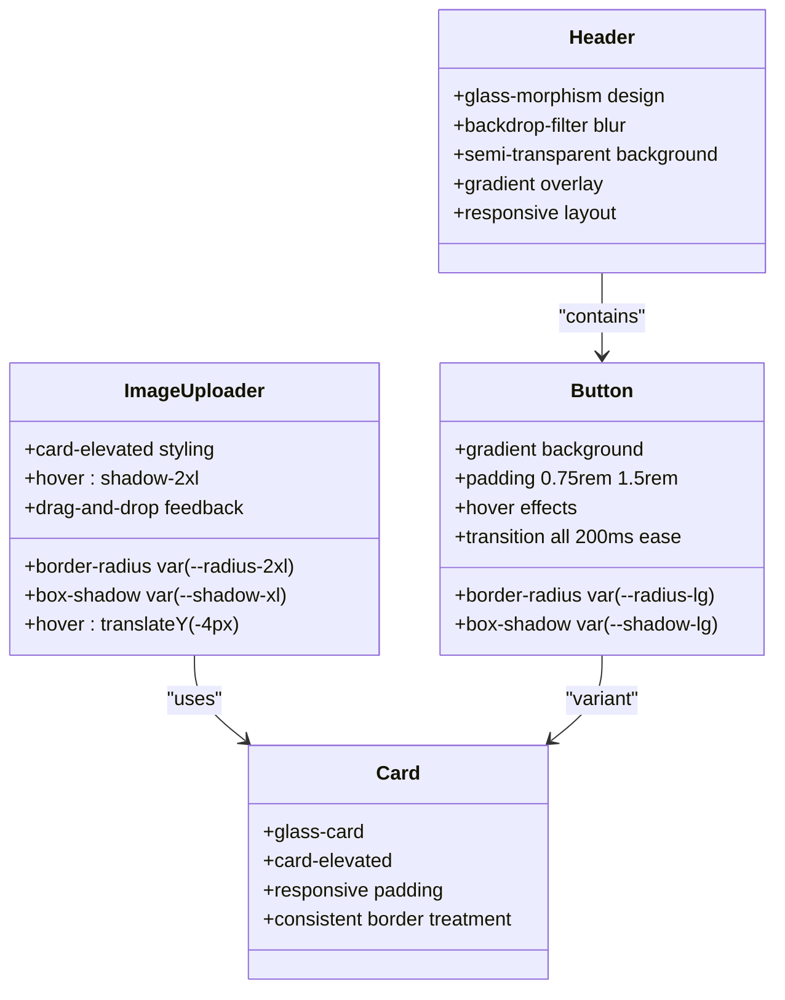

# Styling Strategy

## Table of Contents
1. [Introduction](#introduction)
2. [Utility-First Approach](#utility-first-approach)
3. [Tailwind Configuration](#tailwind-configuration)
4. [CSS Architecture and index.css](#css-architecture-and-indexcss)
5. [Responsive Design Implementation](#responsive-design-implementation)
6. [Animation and Interaction Design](#animation-and-interaction-design)
7. [Accessibility Considerations](#accessibility-considerations)
8. [Component Styling Patterns](#component-styling-patterns)
9. [Theming and Design System Extension](#theming-and-design-system-extension)
10. [Performance and Tree Shaking](#performance-and-tree-shaking)

## Introduction
This document outlines the styling strategy for the Background Remover application, which leverages Tailwind CSS as its primary styling solution. The implementation follows a utility-first approach to enable rapid UI development with minimal custom CSS. The styling system combines Tailwind's atomic classes with custom CSS variables and component-level styling to create a cohesive, responsive, and accessible user interface. The architecture emphasizes maintainability, performance, and design consistency across all components.

## Utility-First Approach
The application employs Tailwind CSS's utility-first methodology, which provides atomic classes for styling elements directly in markup. This approach enables developers to build interfaces rapidly without writing custom CSS for common styling patterns. Utility classes are composable, allowing complex designs to be constructed by combining simple, single-purpose classes. This reduces CSS bloat and ensures design consistency by constraining styling options to a predefined design system. The utility-first approach also facilitates rapid prototyping and iteration, as style changes can be made directly in the JSX without context switching to separate CSS files.

**Section sources**
- [src/components/Header.tsx](../../src/components/Header.tsx#L1-L49)
- [src/components/ImageUploader.tsx](../../src/components/ImageUploader.tsx#L0-L37)
- [src/App.tsx](../../src/App.tsx#L13-L40)

## Tailwind Configuration
The Tailwind configuration is managed through the tailwind.config.js file, which extends the default theme with custom design tokens. The configuration includes custom color palettes for primary, success, and error states, ensuring brand consistency across the application. Custom spacing, border radius, and shadow values are defined to create a cohesive visual language. The purge settings are configured to scan all source files, ensuring unused utility classes are removed in production builds. Plugins are used to extend functionality, including the integration with PostCSS for additional processing.

**Section sources**
- [tailwind.config.js](../../tailwind.config.js)
- [postcss.config.js](../../postcss.config.js#L0-L5)

## CSS Architecture and index.css
The CSS architecture centers around the src/index.css file, which imports Tailwind's base, components, and utilities layers. The file defines custom CSS variables for theming, including color palettes, border radii, shadows, and animations. These variables are used both in custom component classes and referenced in Tailwind's theme configuration. The @layer directive organizes styles into base, components, and utilities, maintaining proper cascade order. Custom scrollbar styles and selection colors are defined globally, while focus states ensure accessibility compliance. The file also imports the Inter font family from Google Fonts to maintain consistent typography.

**Diagram sources**
- [src/index.css](../../src/index.css#L0-L203)

**Section sources**
- [src/index.css](../../src/index.css#L0-L203)
- [postcss.config.js](../../postcss.config.js#L0-L5)

## Responsive Design Implementation
Responsive design is implemented using Tailwind's breakpoint system with sm, md, and lg prefixes. The layout adapts to different screen sizes through flexible grid and flexbox utilities. On mobile devices, content stacks vertically with simplified navigation, while larger screens display more complex layouts with side-by-side components. The Header component, for example, shows a compact logo and title on mobile, with additional feature badges appearing on medium screens and above. The ImageUploader component adjusts its grid layout from single-column on mobile to multi-column on desktop, optimizing space utilization across devices.

**Diagram sources**
- [src/components/Header.tsx](../../src/components/Header.tsx#L28-L49)
- [src/components/ImageUploader.tsx](../../src/components/ImageUploader.tsx#L164-L192)
- [src/components/ImageGallery.tsx](../../src/components/ImageGallery.tsx#L54-L77)

**Section sources**
- [src/components/Header.tsx](../../src/components/Header.tsx#L1-L49)
- [src/components/ImageUploader.tsx](../../src/components/ImageUploader.tsx#L134-L166)
- [src/components/ImageGallery.tsx](../../src/components/ImageGallery.tsx#L54-L77)

## Animation and Interaction Design
The application implements a comprehensive animation system using Tailwind's transition and transform classes combined with custom keyframe animations defined in index.css. Interactive elements feature smooth hover effects, including background gradients, shadow elevation, and subtle translations. The custom animation variables --animate-fade-in, --animate-slide-in, and --animate-scale-in are applied to components for entrance effects. Loading states utilize the animate-spin class with layered spinners for visual interest. The ImageUploader component uses the animate-ping class for pulse effects during drag operations, providing clear visual feedback to users.

**Diagram sources**
- [src/index.css](../../src/index.css#L47-L92)
- [src/components/ImageUploader.tsx](../../src/components/ImageUploader.tsx#L134-L166)
- [src/App.tsx](../../src/App.tsx#L13-L40)

**Section sources**
- [src/index.css](../../src/index.css#L47-L92)
- [src/components/ImageUploader.tsx](../../src/components/ImageUploader.tsx#L134-L166)
- [src/App.tsx](../../src/App.tsx#L13-L40)

## Accessibility Considerations
The styling implementation prioritizes accessibility through careful color contrast, focus states, and semantic markup. Text and interactive elements maintain sufficient contrast ratios against their backgrounds, with primary text at #1f2937 on light backgrounds. Focus states are enhanced with visible outlines using the primary color, ensuring keyboard navigation is clearly indicated. The button:focus-visible rule provides a 2px solid outline with proper offset, meeting WCAG requirements. Selection colors are customized to maintain readability when text is selected. Icon buttons include proper spacing and visual feedback on hover and focus, improving usability for all users.

**Section sources**
- [src/index.css](../../src/index.css#L185-L202)
- [src/App.css](../../src/App.css#L0-L48)
- [src/components/Footer.tsx](../../src/components/Footer.tsx#L54-L85)

## Component Styling Patterns
The application demonstrates consistent styling patterns across components, leveraging both Tailwind utilities and custom CSS classes. The Header component uses a glass-morphism design with backdrop-filter blur and semi-transparent backgrounds, creating a modern, layered effect. The ImageUploader employs a card-based layout with the card-elevated class, featuring rounded corners, shadows, and hover effects. Buttons follow a consistent pattern with gradient backgrounds, defined padding, and interactive states. These patterns are implemented through a combination of utility classes for layout and spacing, and custom component classes for complex visual effects that would be cumbersome to achieve with utilities alone.

**Diagram sources**
- [src/components/Header.tsx](../../src/components/Header.tsx#L1-L49)
- [src/components/ImageUploader.tsx](../../src/components/ImageUploader.tsx#L65-L92)
- [src/index.css](../../src/index.css#L94-L139)

**Section sources**
- [src/components/Header.tsx](../../src/components/Header.tsx#L1-L49)
- [src/components/ImageUploader.tsx](../../src/components/ImageUploader.tsx#L65-L92)
- [src/index.css](../../src/index.css#L94-L139)

## Theming and Design System Extension
The application implements a flexible theming system through CSS variables defined in index.css, allowing for easy customization and extension of the design system. The --color-primary, --color-success, and --color-error scales provide a comprehensive range of tones for different UI states. Border radii and shadows are standardized with semantic names (sm, md, lg, xl, 2xl) that correspond to visual weight. The theming approach enables consistent styling across components while allowing for targeted overrides when needed. Third-party components like react-dropzone integrate seamlessly with the custom theme through utility classes and CSS variable references.

**Section sources**
- [src/index.css](../../src/index.css#L4-L46)
- [src/components/ImageUploader.tsx](../../src/components/ImageUploader.tsx#L191-L203)
- [src/components/ErrorAlert.tsx](../../src/components/ErrorAlert.tsx#L71-L105)

## Performance and Tree Shaking
The styling implementation optimizes performance through Tailwind's tree-shaking capabilities, which remove unused utility classes in production builds. The purge configuration scans all source files to identify used classes, resulting in a significantly smaller CSS bundle. Custom animations are defined as CSS variables and reused across components, minimizing redundant keyframe definitions. The application leverages CSS custom properties for theme values, enabling efficient updates without requiring changes to multiple utility classes. The combination of utility-first styling and tree shaking ensures optimal load times and runtime performance, with only the necessary CSS delivered to the client.

**Section sources**
- [tailwind.config.js](../../tailwind.config.js)
- [src/index.css](../../src/index.css#L0-L203)
- [postcss.config.js](../../postcss.config.js#L0-L5)