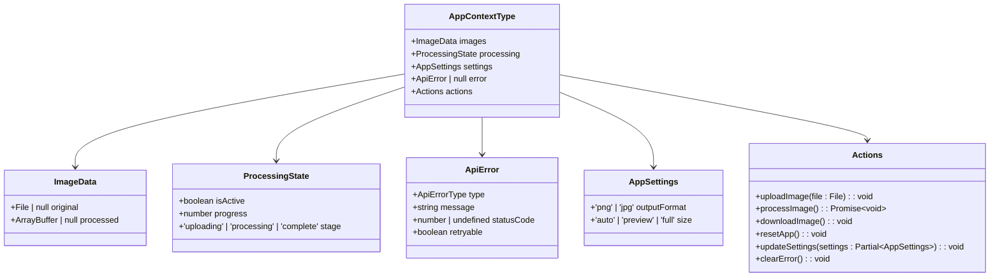
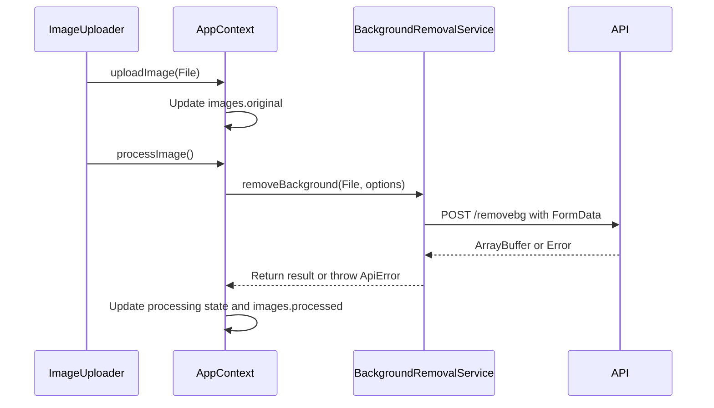
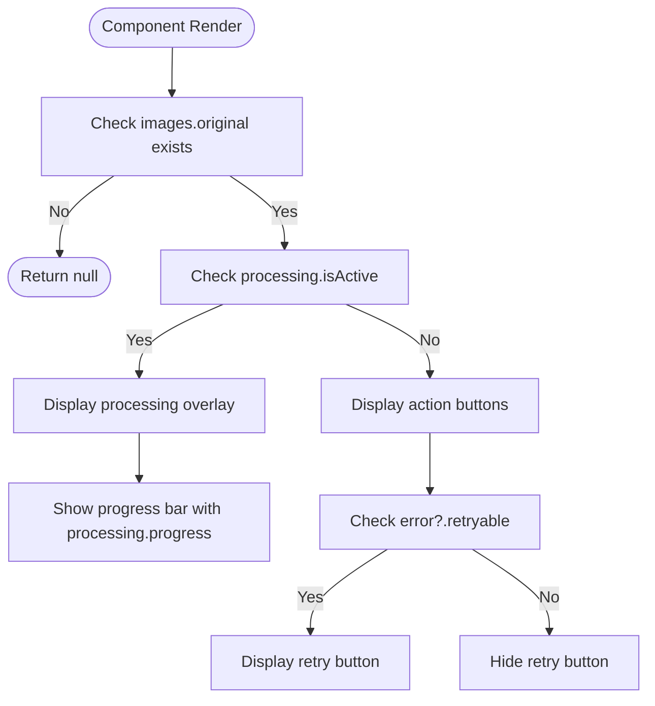

# Type System

<cite>
**Referenced Files in This Document**   
- [index.ts](../../src/types/index.ts)
- [AppContext.tsx](../../src/context/AppContext.tsx)
- [backgroundRemovalService.ts](../../src/services/backgroundRemovalService.ts)
- [ImageProcessor.tsx](../../src/components/ImageProcessor.tsx)
- [ImageUploader.tsx](../../src/components/ImageUploader.tsx)
- [ErrorAlert.tsx](../../src/components/ErrorAlert.tsx)
</cite>

## Table of Contents
1. [Introduction](#introduction)
2. [Core Type Definitions](#core-type-definitions)
3. [AppState and Context Integration](#appstate-and-context-integration)
4. [Type Safety Across Components and Services](#type-safety-across-components-and-services)
5. [Utility Types and Error Handling](#utility-types-and-error-handling)
6. [Component-Level Type Usage](#component-level-type-usage)
7. [Benefits of Centralized Type Definitions](#benefits-of-centralized-type-definitions)
8. [Common Type Errors and Resolutions](#common-type-errors-and-resolutions)
9. [Extending the Type System](#extending-the-type-system)
10. [IDE Integration and Developer Experience](#ide-integration-and-developer-experience)

## Introduction
This document provides comprehensive documentation for the TypeScript type system used in the background removal application. It details the core interfaces and types defined in the project, explains how they ensure type safety across components and services, and demonstrates their integration into the application architecture. The centralized type definitions in `index.ts` serve as the single source of truth for data structures, enabling robust type checking, improved maintainability, and enhanced developer experience through IDE tooling support.

## Core Type Definitions

The application's type system is built around several key interfaces that define the structure of data flowing through the application. These types are defined in `src/types/index.ts` and are imported and used consistently across components, context, and services.

### ImageData Interface
The `ImageData` interface represents the state of image data within the application:
- `original`: Stores the uploaded `File` object or `null` if no image has been uploaded
- `processed`: Holds the resulting `ArrayBuffer` after background removal or `null` if processing hasn't occurred

This type ensures that image data is always handled in a consistent format across the application.

### ProcessingState Interface
The `ProcessingState` interface tracks the current status of image processing:
- `isActive`: Boolean flag indicating whether processing is currently underway
- `progress`: Number representing the completion percentage (0-100)
- `stage`: Union type with three possible values: `'uploading'`, `'processing'`, or `'complete'`

This structured approach to state management prevents invalid states and provides clear progression tracking.

### ApiError Interface
The `ApiError` interface standardizes error handling throughout the application:
- `type`: Discriminated union of error types (e.g., `'INVALID_API_KEY'`, `'INSUFFICIENT_CREDITS'`)
- `message`: Human-readable error description
- `statusCode`: Optional HTTP status code for server responses
- `retryable`: Boolean indicating whether the operation can be retried

The use of a discriminated union (`ApiErrorType`) enables type-safe error handling with exhaustive checking.

**Section sources**
- [index.ts](../../src/types/index.ts#L32-L35)
- [index.ts](../../src/types/index.ts#L21-L25)
- [index.ts](../../src/types/index.ts#L8-L13)

## AppState and Context Integration

The application state is structured through the combination of multiple interfaces that are composed together in the context system. The `AppContextType` interface defines the complete shape of the application state available to components via React Context.

### State Composition
The application state combines several interfaces:
- `images`: Instance of `ImageData` for managing original and processed images
- `processing`: Instance of `ProcessingState` for tracking processing status
- `settings`: Configuration options for output format and size
- `error`: Optional `ApiError` instance for displaying error messages

This composition creates a cohesive state structure that is both comprehensive and type-safe.

### Actions Interface
The context also exposes an `actions` object containing methods for state manipulation:
- `uploadImage`: Accepts a `File` parameter and updates the image state
- `processImage`: Returns a Promise for asynchronous processing
- `downloadImage`: Initiates download of processed image
- `resetApp`: Clears all state to initial values
- `updateSettings`: Accepts partial `AppSettings` for configuration updates
- `clearError`: Removes current error state

These action signatures are fully typed, ensuring correct usage throughout the component tree.



**Diagram sources**
- [index.ts](../../src/types/index.ts#L32-L35)
- [index.ts](../../src/types/index.ts#L21-L25)
- [index.ts](../../src/types/index.ts#L8-L13)
- [index.ts](../../src/types/index.ts#L45-L50)
- [AppContext.tsx](../../src/context/AppContext.tsx#L15-L20)

**Section sources**
- [index.ts](../../src/types/index.ts#L45-L50)
- [AppContext.tsx](../../src/context/AppContext.tsx#L15-L20)

## Type Safety Across Components and Services

The type system ensures consistency and safety across the entire application, from UI components to backend services.

### Service Layer Typing
The `BackgroundRemovalService` class uses the defined types to enforce correct API interactions:
- The `removeBackground` method accepts a `File` and `RemovalOptions` interface
- It returns a Promise that resolves to an `ArrayBuffer`
- Error handling converts API responses into properly typed `ApiError` objects
- Input validation ensures files meet size and format requirements before processing

This strict typing prevents common issues like sending invalid data to the API or mishandling responses.

### Component Integration
Components consume the typed context through the `useApp` hook, which guarantees type-safe access to application state:
- `ImageProcessor` accesses `images.original`, `processing`, and action methods
- `ImageUploader` uses `uploadImage` and `resetApp` actions
- `ErrorAlert` displays information from the `error` property

The type system prevents accessing properties that don't exist or using methods with incorrect parameters.



**Diagram sources**
- [backgroundRemovalService.ts](../../src/services/backgroundRemovalService.ts#L15-L135)
- [AppContext.tsx](../../src/context/AppContext.tsx#L15-L20)
- [ImageUploader.tsx](../../src/components/ImageUploader.tsx#L25-L203)
- [ImageProcessor.tsx](../../src/components/ImageProcessor.tsx#L25-L185)

**Section sources**
- [backgroundRemovalService.ts](../../src/services/backgroundRemovalService.ts#L15-L135)

## Utility Types and Error Handling

The application leverages TypeScript's advanced type features to create a robust error handling system.

### Discriminated Unions
The `ApiErrorType` union type serves as a discriminant for error handling:
- Compile-time checking ensures all error cases are handled
- Enables exhaustive switch statements in error processing
- Provides clear categorization of error types (authentication, network, processing)

### Type Guards
The `isApiError` function in `BackgroundRemovalService` acts as a type predicate:
```typescript
private isApiError(error: unknown): error is ApiError
```
This utility function narrows the type from `unknown` to `ApiError` after validation, enabling safe property access.

### Partial Utility Type
The `updateSettings` action uses `Partial<AppSettings>` to allow updating only specific properties:
- Permits partial updates without requiring all settings
- Maintains type safety for the properties that are provided
- Prevents invalid property names through interface restriction

This pattern enhances flexibility while preserving type correctness.

**Section sources**
- [index.ts](../../src/types/index.ts#L1-L13)
- [backgroundRemovalService.ts](../../src/services/backgroundRemovalService.ts#L120-L135)

## Component-Level Type Usage

Components throughout the application demonstrate consistent type usage patterns that enhance reliability and maintainability.

### ImageProcessor Component
The `ImageProcessor` component uses several type-driven features:
- `useApp()` hook provides fully typed access to application state
- Conditional rendering based on `images.original` and `processing.isActive`
- Progress display tied to `processing.progress` and `processing.stage`
- Action handlers that call typed context methods

The component's logic is driven by the type-defined state, ensuring consistency with the application's data model.

### ErrorAlert Component
The `ErrorAlert` component showcases advanced type utilization:
- Discriminated union pattern to determine error appearance
- Type-based configuration mapping for visual presentation
- Conditional rendering of retry button based on `retryable` flag
- Comprehensive error type coverage through exhaustive switch statement

This approach ensures that all possible error states are handled appropriately in the UI.



**Diagram sources**
- [ImageProcessor.tsx](../../src/components/ImageProcessor.tsx#L25-L185)
- [ErrorAlert.tsx](../../src/components/ErrorAlert.tsx#L15-L118)

**Section sources**
- [ImageProcessor.tsx](../../src/components/ImageProcessor.tsx#L25-L185)
- [ErrorAlert.tsx](../../src/components/ErrorAlert.tsx#L15-L118)

## Benefits of Centralized Type Definitions

The centralized type system in `src/types/index.ts` provides significant advantages for maintainability and development efficiency.

### Single Source of Truth
All components and services reference the same type definitions, ensuring consistency across the application. When a type needs to be modified, changes are made in one location and automatically propagate throughout the codebase.

### Refactoring Safety
TypeScript's compile-time checking enables safe refactoring:
- Renaming a property triggers errors in all locations where it's used
- Changing an interface structure highlights all affected code
- Removing deprecated types identifies code that needs updating

This safety net reduces the risk of introducing bugs during maintenance.

### Documentation Value
The type definitions serve as living documentation:
- Clear interface definitions explain data structure
- Union types document valid values for properties
- Exported types indicate public API contracts
- File organization groups related types together

Developers can understand the data model by examining the type definitions without needing to trace through implementation code.

**Section sources**
- [index.ts](../../src/types/index.ts#L1-L50)

## Common Type Errors and Resolutions

Developers may encounter specific type-related issues when working with this codebase. Understanding these common errors helps maintain type safety.

### Property Access Errors
Attempting to access properties that may be null:
```typescript
// Error: Object is possibly 'null'
const fileName = state.images.original.name;
```
**Resolution**: Use optional chaining or null checks:
```typescript
const fileName = state.images.original?.name;
// or
if (state.images.original) { /* safe to access */ }
```

### Union Type Exhaustiveness
Switch statements that don't handle all union members:
```typescript
// Error: Not all code paths return a value
switch(error.type) {
  case 'INVALID_API_KEY': return config1;
  case 'INSUFFICIENT_CREDITS': return config2;
  // Missing cases...
}
```
**Resolution**: Add default case or handle all members:
```typescript
default: return fallbackConfig;
```

### Type Assertion Misuse
Improper use of type assertions can bypass type safety:
```typescript
// Risky: Bypasses type checking
const error = response.data as ApiError;
```
**Resolution**: Use type guards or proper validation:
```typescript
if (isApiError(response.data)) {
  // Type is now safely narrowed
}
```

**Section sources**
- [AppContext.tsx](../../src/context/AppContext.tsx#L15-L20)
- [backgroundRemovalService.ts](../../src/services/backgroundRemovalService.ts#L120-L135)

## Extending the Type System

When adding new functionality, the type system should be extended following established patterns.

### Adding New Error Types
To introduce a new error condition:
1. Add the error type to `ApiErrorType` union
2. Update `handleApiErrors` to map HTTP responses
3. Ensure UI components handle the new type appropriately

### Enhancing Data Interfaces
To extend `ImageData` with new properties:
1. Modify the interface in `index.ts`
2. Update `initialState` in `AppContext`
3. Adjust all components that use the interface
4. Consider backward compatibility for existing code

### Creating New Utility Types
For complex type transformations:
1. Define new utility types in `index.ts`
2. Use TypeScript's built-in utilities when possible
3. Document the purpose and usage of custom utilities
4. Test type behavior with various input scenarios

Following these patterns ensures that extensions maintain the integrity and consistency of the type system.

**Section sources**
- [index.ts](../../src/types/index.ts#L1-L50)
- [AppContext.tsx](../../src/context/AppContext.tsx#L25-L35)

## IDE Integration and Developer Experience

The TypeScript type system significantly enhances the developer experience through IDE integration.

### Autocompletion and IntelliSense
IDEs provide intelligent suggestions based on type definitions:
- Context actions show available methods and properties
- Parameter hints display expected types for function calls
- Interface properties are auto-completed with correct names
- Error types are suggested based on union members

### Inline Error Detection
TypeScript identifies issues in real-time:
- Red squiggles highlight type mismatches
- Hover tooltips explain type errors
- Unused variables and imports are flagged
- Dead code is identified through unreachable branches

### Navigation and Refactoring
IDE features leverage type information:
- "Go to Definition" navigates to interface declarations
- "Find All References" locates type usage
- Rename refactoring updates all references safely
- Code folding organizes type definitions

These features reduce cognitive load and increase development velocity by providing immediate feedback and reducing the need to manually track type usage across files.

**Section sources**
- [index.ts](../../src/types/index.ts#L1-L50)
- [AppContext.tsx](../../src/context/AppContext.tsx#L15-L20)