# User Workflow

## Table of Contents
1. [Landing Page and Initial State](#landing-page-and-initial-state)
2. [Image Upload Process](#image-upload-process)
3. [Client-Side Validation](#client-side-validation)
4. [Processing Initiation](#processing-initiation)
5. [Progress Indication](#progress-indication)
6. [Result Rendering and Comparison](#result-rendering-and-comparison)
7. [Download Functionality](#download-functionality)
8. [Error Handling Scenarios](#error-handling-scenarios)
9. [Timing Considerations and UX Patterns](#timing-considerations-and-ux-patterns)
10. [Best Practices for Optimal Results](#best-practices-for-optimal-results)
11. [Accessibility Features](#accessibility-features)
12. [Troubleshooting Common Issues](#troubleshooting-common-issues)

## Landing Page and Initial State

When users first access the Background Remover application, they are presented with a clean, modern interface featuring a prominent hero section that explains the application's purpose. The landing page displays a gradient background with decorative elements and a clear value proposition: "Remove Backgrounds Instantly with AI." Key features are highlighted with icons and brief descriptions, emphasizing speed, AI technology, and security.

The main content area initially displays the image upload component, which serves as the entry point for the user workflow. Users are greeted with a glassmorphic card that invites them to either drag and drop an image or browse for a file. This initial state persists until an image is successfully uploaded and validated.

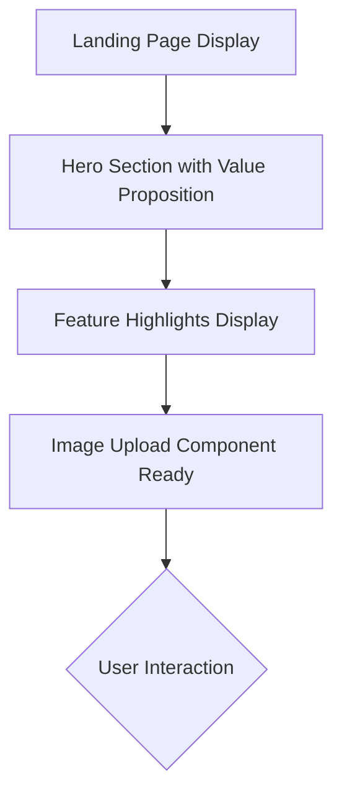

**Diagram sources**
- [App.tsx](../../src/App.tsx#L15-L117)
- [ImageUploader.tsx](../../src/components/ImageUploader.tsx#L1-L203)

**Section sources**
- [App.tsx](../../src/App.tsx#L15-L117)
- [README.md](../../README.md#L1-L188)

## Image Upload Process

The image upload process supports two primary methods: drag-and-drop and file browser selection. The application uses the `react-dropzone` library to implement an intuitive drag-and-drop interface that provides visual feedback during the upload process. When users drag a file over the upload area, the component transforms with enhanced visual effects, including a glowing border and animated upload icon.

For users who prefer the traditional file browser approach, clicking on the upload area opens the system's file selection dialog. The interface clearly indicates that both methods are available, with the text "Drag & drop an image here, or browse files" providing explicit instructions.

Once an image is selected through either method, the application immediately creates a preview URL using `URL.createObjectURL()` and displays the image in a card with metadata including the filename and file size. A clear button with an "X" icon allows users to remove the selected image and return to the initial upload state.

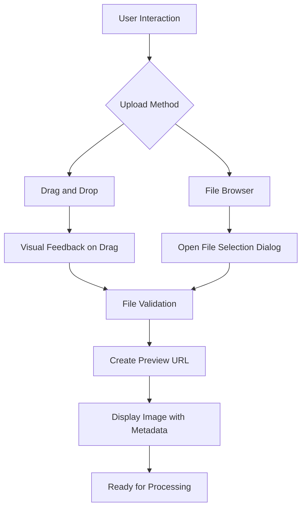

**Diagram sources**
- [ImageUploader.tsx](../../src/components/ImageUploader.tsx#L1-L203)
- [AppContext.tsx](../../src/context/AppContext.tsx#L1-L234)

**Section sources**
- [ImageUploader.tsx](../../src/components/ImageUploader.tsx#L1-L203)
- [AppContext.tsx](../../src/context/AppContext.tsx#L1-L234)

## Client-Side Validation

The application implements comprehensive client-side validation to ensure that only appropriate files are processed. Validation occurs both during the drag operation and after file selection. The system checks for two primary criteria: file format and file size.

Supported formats are strictly limited to JPEG, PNG, and WEBP, as defined in the `ACCEPTED_FORMATS` constant. The maximum file size is set to 12MB, as specified by the `MAX_FILE_SIZE` constant. These requirements are clearly displayed below the upload area, with icons indicating the accepted formats, maximum size, and quality expectations.

When users attempt to upload an invalid file, the interface provides immediate visual feedback. If an unsupported format is dragged over the upload area, the border turns red and the message changes to "Invalid file type or size" with "Please check the file requirements below." This real-time validation prevents unnecessary API calls and provides users with clear guidance on acceptable files.

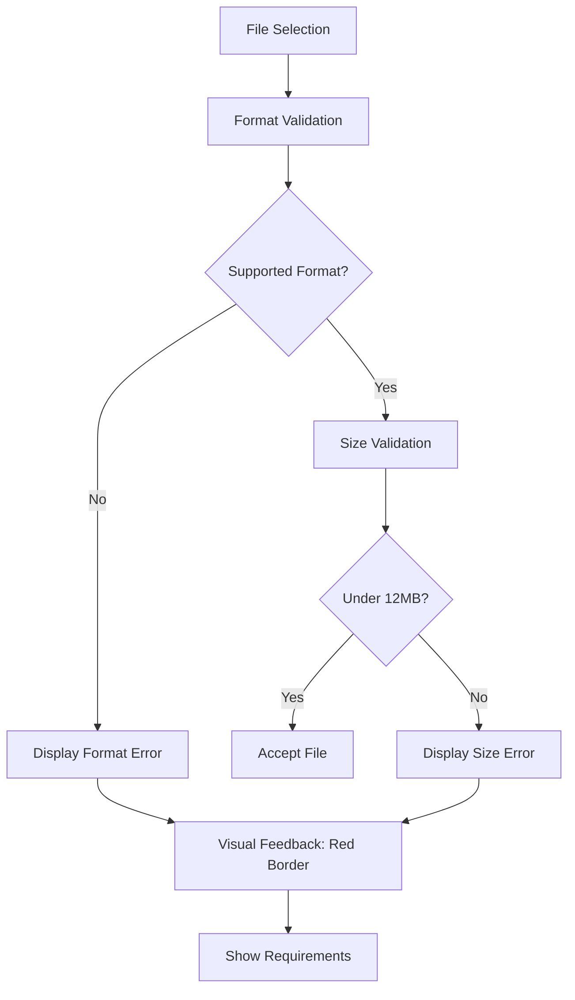

**Diagram sources**
- [ImageUploader.tsx](../../src/components/ImageUploader.tsx#L1-L203)
- [backgroundRemovalService.ts](../../src/services/backgroundRemovalService.ts#L1-L135)

**Section sources**
- [ImageUploader.tsx](../../src/components/ImageUploader.tsx#L1-L203)
- [backgroundRemovalService.ts](../../src/services/backgroundRemovalService.ts#L1-L135)

## Processing Initiation

After a valid image is uploaded, the workflow transitions to the processing phase. The ImageProcessor component displays a clean interface with the original image and two primary action buttons: "Choose Different Image" and "Remove Background." Before processing can begin, users must have entered their remove.bg API key, which is managed through the application header.

Clicking the "Remove Background" button triggers the `processImage()` function in the AppContext. This function first validates that an image is present, then dispatches a "START_PROCESSING" action to update the application state. The processing state includes a progress indicator and stage tracking, which helps manage the user experience during the API call.

The service layer, implemented in `backgroundRemovalService.ts`, constructs a FormData object containing the image file and processing options (size and format). It then makes a POST request to the remove.bg API endpoint with the user's API key included in the headers. The request includes timeout handling (30 seconds) and error handling for network issues.

```mermaid
flowchart TD
A[Valid Image Uploaded] --> B[Display Processing Interface]
B --> C[User Clicks "Remove Background"]
C --> D[Validate Image Present]
D --> E[Dispatch START_PROCESSING]
E --> F[Prepare FormData]
F --> G[Set API Headers with Key]
G --> H[Make POST Request to API]
H --> I[Monitor Request Progress]
```

**Diagram sources**
- [ImageProcessor.tsx](../../src/components/ImageProcessor.tsx#L1-L185)
- [AppContext.tsx](../../src/context/AppContext.tsx#L1-L234)
- [backgroundRemovalService.ts](../../src/services/backgroundRemovalService.ts#L1-L135)

**Section sources**
- [ImageProcessor.tsx](../../src/components/ImageProcessor.tsx#L1-L185)
- [AppContext.tsx](../../src/context/AppContext.tsx#L1-L234)

## Progress Indication

During image processing, the application provides rich visual feedback to keep users informed about the progress. A modal overlay appears over the image with an animated loading indicator that includes a multi-layered spinner with pulsing effects. The interface clearly communicates the current stage of processing: "Uploading Image..." or "AI Processing..." depending on the progress percentage.

A sophisticated progress bar shows the exact percentage complete, with a gradient fill that moves smoothly from left to right. The progress bar is accompanied by stage indicators that show the two main phases: Upload (which turns green when complete) and Process (which animates during processing). This dual feedback system—percentage and stage—helps users understand not just how much is done, but what is currently happening.

The progress is simulated on the client side with incremental updates, providing a smooth user experience even if the actual API response times vary. This approach prevents the interface from appearing stuck during potentially variable network conditions.

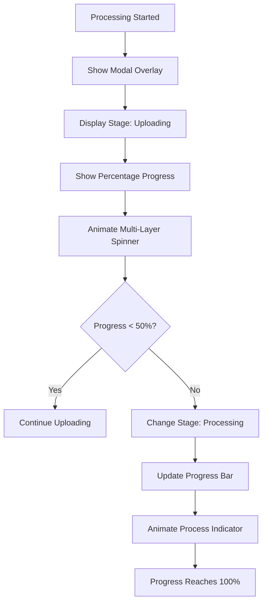

**Diagram sources**
- [ImageProcessor.tsx](../../src/components/ImageProcessor.tsx#L1-L185)
- [AppContext.tsx](../../src/context/AppContext.tsx#L1-L234)

**Section sources**
- [ImageProcessor.tsx](../../src/components/ImageProcessor.tsx#L1-L185)
- [AppContext.tsx](../../src/context/AppContext.tsx#L1-L234)

## Result Rendering and Comparison

Once processing is complete, the application transitions to the results view, where users can see their background-removed image. The ImageGallery component provides multiple ways to view and compare the original and processed images. By default, only the processed image is displayed with a success banner indicating "Background Removed Successfully!"

Users can toggle a comparison view that reveals two powerful comparison tools. First, a before/after slider allows users to drag a vertical divider across the image to reveal either the original or processed version. This interactive slider provides precise control over the comparison, helping users evaluate the quality of the background removal at specific areas.

Second, a side-by-side comparison displays both images simultaneously, with the processed image shown over a checkerboard pattern that indicates transparency. This pattern is important for users to understand which parts of the image are truly transparent versus white. The original image is displayed without any background pattern for clear contrast.

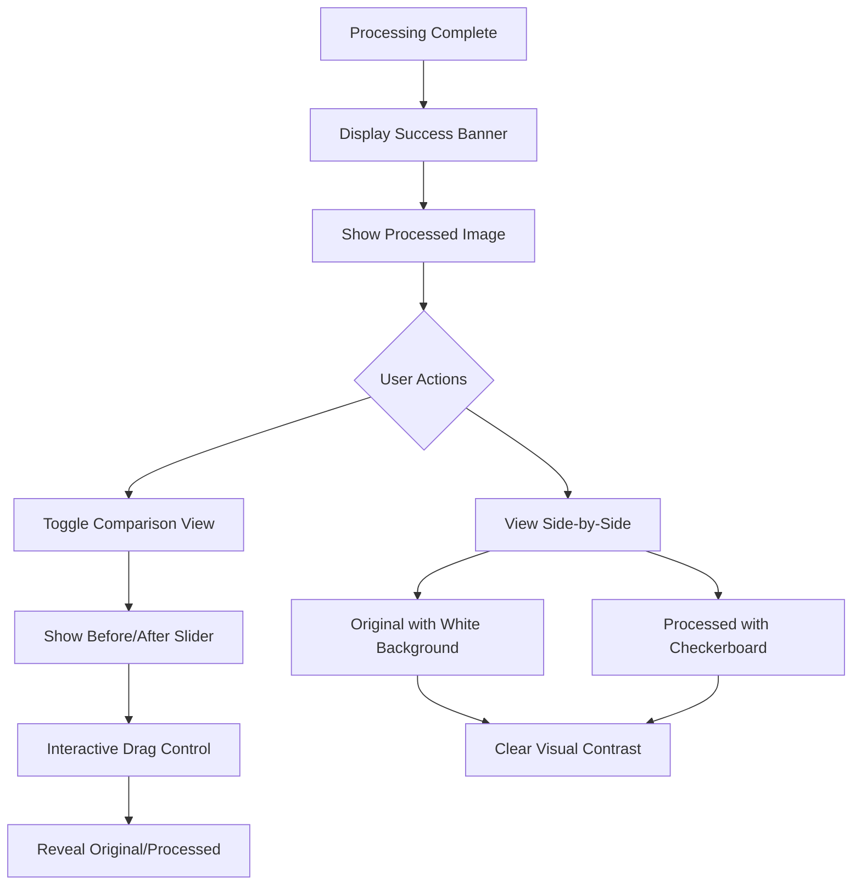

**Diagram sources**
- [ImageGallery.tsx](../../src/components/ImageGallery.tsx#L1-L242)
- [AppContext.tsx](../../src/context/AppContext.tsx#L1-L234)

**Section sources**
- [ImageGallery.tsx](../../src/components/ImageGallery.tsx#L1-L242)
- [AppContext.tsx](../../src/context/AppContext.tsx#L1-L234)

## Download Functionality

The application provides straightforward download functionality for processed images. When users click the "Download" button, the system creates a Blob from the processed image data (an ArrayBuffer) with a MIME type of 'image/png' to preserve transparency. The filename is automatically generated with a timestamp to prevent naming conflicts.

A loading state is implemented on the download button, which shows "Downloading..." and includes a bouncing animation on the download icon. This provides immediate feedback that the download process has started. After the download is initiated, the button state returns to normal after a brief delay to prevent multiple rapid clicks.

The download is triggered programmatically by creating a temporary anchor element, setting its href to the object URL of the Blob, and simulating a click. This approach works across all modern browsers and doesn't require any server-side processing. After the download completes, the object URL is revoked to free up memory.

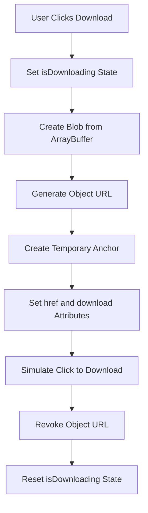

**Diagram sources**
- [ImageGallery.tsx](../../src/components/ImageGallery.tsx#L1-L242)
- [AppContext.tsx](../../src/context/AppContext.tsx#L1-L234)

**Section sources**
- [ImageGallery.tsx](../../src/components/ImageGallery.tsx#L1-L242)
- [AppContext.tsx](../../src/context/AppContext.tsx#L1-L234)

## Error Handling Scenarios

The application implements comprehensive error handling for various failure scenarios, with the ErrorAlert component serving as the central mechanism for user feedback. Different error types are categorized and displayed with appropriate icons, colors, and retry options.

For **invalid file formats**, the system prevents upload and displays an orange warning with an "Unsupported Format" message. For **API authentication failures** (invalid API key or insufficient credits), a red error alert appears with specific guidance on how to resolve the issue. **Network issues** trigger a yellow warning with a "Retry" button, acknowledging that the problem may be temporary.

Each error type has a distinct visual treatment based on severity: red for critical errors (authentication), yellow for warnings (network issues), and orange for format/size issues. The ErrorAlert component also provides appropriate actions—either a retry button for transient errors or a close button for permanent issues—allowing users to respond appropriately to different error conditions.

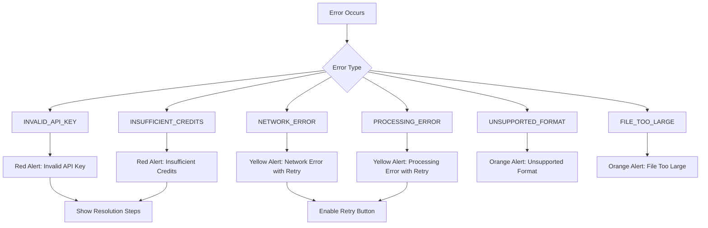

**Diagram sources**
- [ErrorAlert.tsx](../../src/components/ErrorAlert.tsx#L1-L118)
- [backgroundRemovalService.ts](../../src/services/backgroundRemovalService.ts#L1-L135)
- [index.ts](../../src/types/index.ts#L1-L50)

**Section sources**
- [ErrorAlert.tsx](../../src/components/ErrorAlert.tsx#L1-L118)
- [backgroundRemovalService.ts](../../src/services/backgroundRemovalService.ts#L1-L135)

## Timing Considerations and UX Patterns

The application employs several UX patterns to manage user expectations around timing and processing duration. Loading skeletons and animations are used throughout the workflow to provide immediate feedback and reduce perceived wait times. The multi-layered spinner with counter-rotating rings creates a sense of activity and progress even when the exact timing is uncertain.

Progress is simulated on the client side with incremental updates, creating a smooth progression from 0% to 100%. This approach prevents the interface from appearing stuck during the initial network request phase. The two-stage progress indicator (upload vs. processing) helps users understand that there are distinct phases to the operation, setting appropriate expectations for duration.

The application also uses subtle animations for state transitions, including fade-in, slide-in, and scale-in effects when moving between workflow stages. These animations provide visual continuity and help users understand the flow of the application. The timing of these animations is carefully calibrated to feel responsive without causing delays.

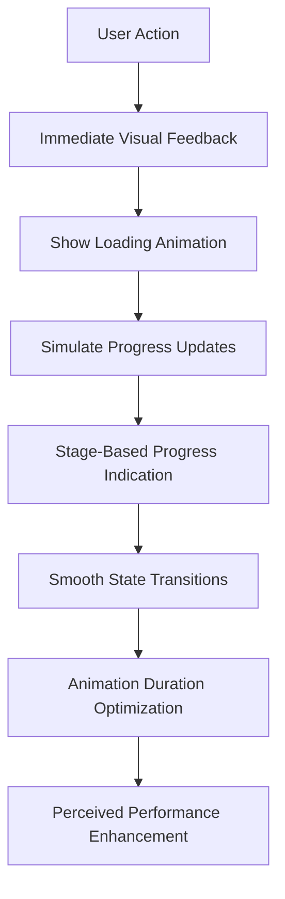

**Diagram sources**
- [ImageProcessor.tsx](../../src/components/ImageProcessor.tsx#L1-L185)
- [ImageUploader.tsx](../../src/components/ImageUploader.tsx#L1-L203)
- [ImageGallery.tsx](../../src/components/ImageGallery.tsx#L1-L242)

**Section sources**
- [ImageProcessor.tsx](../../src/components/ImageProcessor.tsx#L1-L185)
- [ImageUploader.tsx](../../src/components/ImageUploader.tsx#L1-L203)

## Best Practices for Optimal Results

To achieve the best results with the Background Remover application, users should follow several recommended practices. Images with high contrast between the subject and background tend to produce the most accurate results, as the AI can more easily distinguish the boundaries. Well-lit subjects with even illumination across the entire image also improve processing quality.

For portrait photography, ensuring that hair details are well-defined and not blending into the background helps preserve these fine elements during processing. Users should avoid images with transparent or semi-transparent elements, as these can be challenging for the AI to handle correctly.

The application works best with subjects that have clear, defined edges. Complex textures like fur, feathers, or intricate lace may require additional refinement after processing. Users are encouraged to review the results carefully, particularly around detailed areas, to ensure the output meets their requirements.

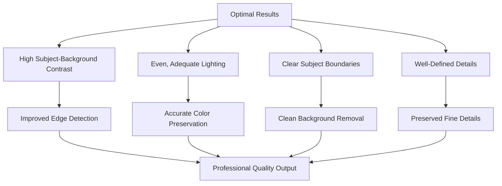

**Section sources**
- [README.md](../../README.md#L1-L188)

## Accessibility Features

The application incorporates several accessibility features to ensure usability for keyboard and screen reader users. All interactive elements are focusable and have appropriate ARIA labels and roles. The drag-and-drop interface remains fully functional via keyboard navigation, with visual focus indicators that meet contrast requirements.

Button elements include descriptive text that is accessible to screen readers, and icon buttons are paired with text alternatives. Error messages are announced by screen readers when they appear, ensuring that users with visual impairments are aware of any issues.

The color scheme maintains sufficient contrast between text and background elements, meeting WCAG 2.1 AA standards. Interactive elements provide multiple visual cues (color, shape, and text) to accommodate users with color vision deficiencies. Keyboard traps are avoided, and users can navigate through all functionality using the tab key.

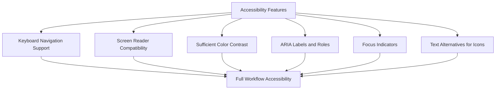

**Section sources**
- [ImageUploader.tsx](../../src/components/ImageUploader.tsx#L1-L203)
- [ImageProcessor.tsx](../../src/components/ImageProcessor.tsx#L1-L185)
- [ImageGallery.tsx](../../src/components/ImageGallery.tsx#L1-L242)

## Troubleshooting Common Issues

When users encounter issues with the application, several common problems and solutions should be considered. For "Invalid API Key" errors, users should verify that they have entered the correct key from their remove.bg account and check their account status for sufficient credits.

"File Too Large" errors can be resolved by resizing images before upload or compressing them to reduce file size while maintaining quality. Users experiencing "Network Error" messages should check their internet connection and try again after a brief wait, as temporary connectivity issues are often resolved quickly.

If processing fails repeatedly with the same image, users should try a different image format or ensure the file is not corrupted. Clearing the browser cache and refreshing the page can resolve issues related to stale state or corrupted temporary files.

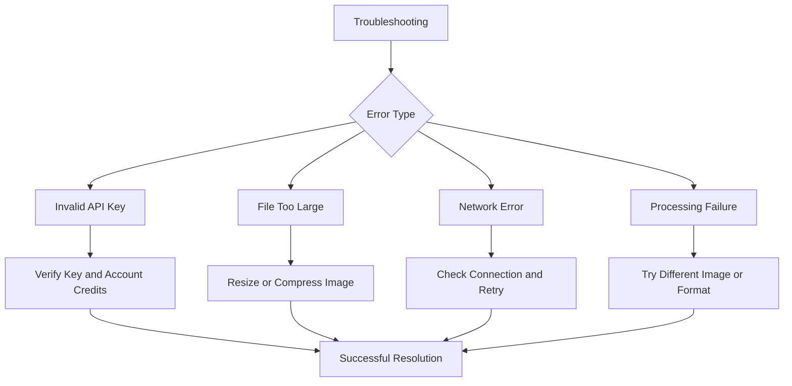

**Section sources**
- [README.md](../../README.md#L1-L188)
- [ErrorAlert.tsx](../../src/components/ErrorAlert.tsx#L1-L118)
- [backgroundRemovalService.ts](../../src/services/backgroundRemovalService.ts#L1-L135)